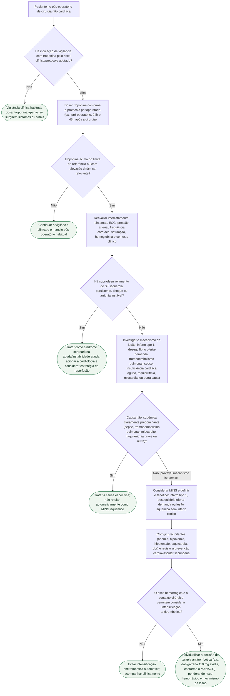

# Fluxograma: MINS — lesão miocárdica pós-operatória, vigilância com troponina e conduta

Troponina elevada no pós-operatório significa **lesão miocárdica**, não necessariamente trombose coronária — e a maioria dos pacientes com MINS (myocardial injury after noncardiac surgery) é assintomática. Rotular automaticamente "MINS" diante de qualquer troponina alterada pula uma etapa obrigatória: primeiro diferenciar instabilidade aguda e causa não isquêmica, só depois considerar MINS propriamente dito.

## Árvore de decisão

## O que a árvore não mostra

**O que o VISION mostrou sobre gravidade:** em 21.842 pacientes com hs-cTnT seriada, a mortalidade em 30 dias subiu de 0,5% (pico <20 ng/L) para 29,6% (pico ≥1000 ng/L) — a maioria dos casos classificados como MINS não teve nenhum sintoma isquêmico típico, o que justifica a vigilância seriada em vez de dosar troponina só diante de queixa.

**Em ambos os ramos finais (C5 e C6), planejar seguimento cardiovascular ambulatorial após a alta é considerado razoável pela AHA/ACC 2024** — independentemente de a decisão antitrombótica ter sido intensificar ou não.

**O MANAGE testou dabigatrana 110 mg 2x/dia em pacientes selecionados com MINS**, com redução do desfecho vascular composto sem sinal de aumento significativo de sangramento maior no ensaio — mas essa dose é a intervenção testada, não uma prescrição automática para qualquer troponina elevada; a decisão depende de hemostasia cirúrgica, função renal, risco hemorrágico e mecanismo provável da lesão.