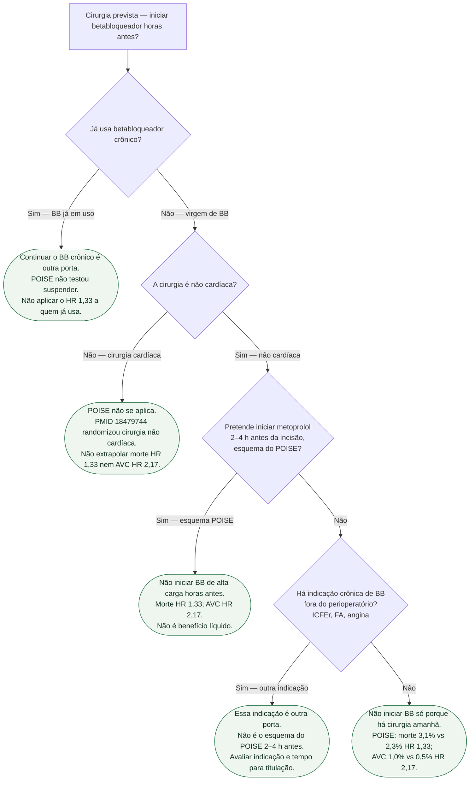

# Fluxograma: não iniciar BB estilo POISE horas antes

Pergunta desta árvore: **neste paciente que vai a cirurgia, o POISE autoriza iniciar betabloqueador horas antes da incisão?** Folhas verdes são condutas. O composto primário caiu; **morte e AVC subiram**. Continuar um betabloqueador **já em uso** é outra porta — o POISE **não** testou a suspensão. Esta árvore **não** atribui Classe I, IIa, IIb ou III. 

Confirmação em série: cirurgia **não cardíaca** **e** virgem de betabloqueador **e** a proposta é o esquema do POISE (início **2–4 h** antes). Só então a folha de não iniciar. Não misturar com o AAS do POISE-2.

## Árvore de decisão

## Como ler cada folha

**C1 — já usa betabloqueador crônico.** Continuar é outra porta. O POISE randomizou início **2–4 h** antes, não a suspensão do comprimido da ICFEr, da FA ou da angina. Não copiar o HR **1,33** nem o HR **2,17** para quem já usa. 

**C2 — cirurgia cardíaca.** PMID **18479744**: **8351** pacientes, cirurgia **não cardíaca**, 190 hospitais, 23 países. Metoprolol succinato de liberação prolongada **4174** versus placebo **4177**. 

**C3 — o colega quer o esquema do POISE.** Início **2–4 h** antes, até **30** dias. Primário (morte CV, IAM não fatal ou parada cardíaca não fatal): **244 (5,8%)** vs **290 (6,9%)**; **HR 0,84** (0,70–0,99); P=0,0399. IAM: **176 (4,2%)** vs **239 (5,7%)**; HR **0,73** (0,60–0,89); P=0,0017. **Morte**: **129 (3,1%)** vs **97 (2,3%)**; **HR 1,33** (1,03–1,74); P=0,0317. **AVC**: **41 (1,0%)** vs **19 (0,5%)**; **HR 2,17** (1,26–3,74); P=0,0053. O composto melhorou porque o IAM caiu. Morte e AVC **subiram**. Não cite o 0,84 sem o 1,33 e o 2,17. Não iniciar.

**C4 — indicação crônica que ainda não estava em uso.** ICFEr, FA com controle de frequência, angina: outra porta, outro ensaio, outra ficha. Não é “começar 2–4 h antes para proteger o coração da cirurgia”. 

**C5 — sem indicação crônica e sem esquema POISE.** Folha irmã de C3: não iniciar betabloqueador só porque a lista cirúrgica existe. Frequências naturais em 30 dias: morte em **3 em 100** com o esquema do POISE e em **2 em 100** com placebo. AVC em **1 em 100** vs **0,5 em 100**. **8331 (99,8%)** completaram o seguimento de 30 dias.

## Aplicação atual

A [AHA/ACC 2024](https://www.ahajournals.org/doi/10.1161/CIR.0000000000001285) orienta manter o betabloqueador crônico quando apropriado. Uma nova indicação em cirurgia eletiva deve ser avaliada com antecedência, idealmente mais de sete dias, permitindo titulação e avaliação de tolerância. Sem necessidade imediata, não iniciar no próprio dia da cirurgia. Instabilidade, hipotensão e bradicardia exigem avaliação individual.

## Tudo com Tudo

- [POISE-2: AAS perioperatório não reduz morte ou IAM — aumenta sangramento](/biblioteca/poise-2-aas-nao-reduz-morte-ou-iam)
- [POISE-2 clonidina: não reduz IAM — aumenta hipotensão e parada](/biblioteca/poise-2-clonidina-nao-reduz-iam-e-aumenta-hipotensao)
- [POISE: betabloqueador iniciado horas antes — não é benefício líquido](/biblioteca/poise-bb-iniciado-horas-antes-nao-e-beneficio-liquido)
