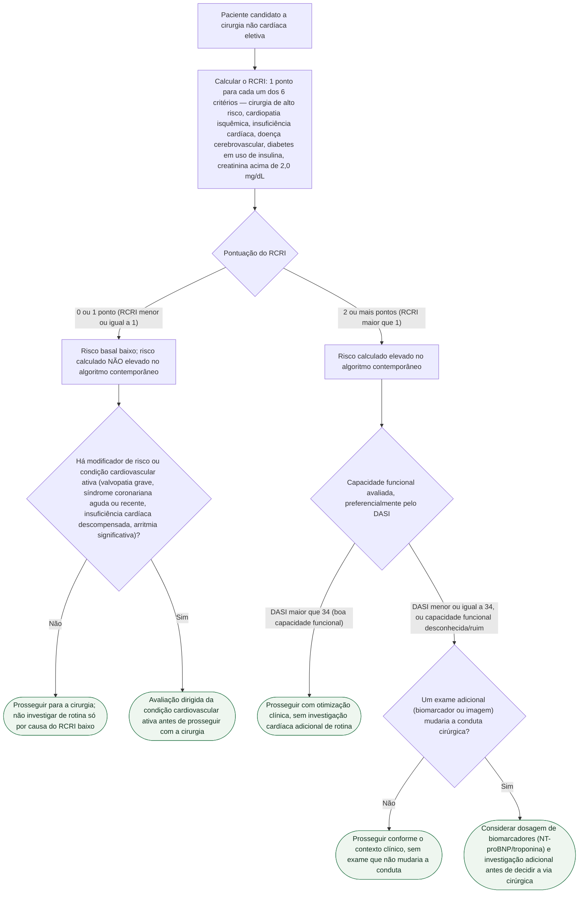

# Fluxograma: RCRI — estratificação de risco cardíaco cirúrgico e conduta

O Revised Cardiac Risk Index (RCRI) é a porta de entrada mais usada para estratificar risco cardíaco antes de cirurgia não cardíaca — seis critérios binários, um ponto cada. O ponto que costuma ser pulado é que o número final **não é uma autorização cirúrgica**: ele decide se a avaliação segue por um caminho de baixa exigência ou se abre a pergunta seguinte, sobre capacidade funcional e necessidade de investigação adicional.

Os seis critérios que compõem a pontuação: cirurgia de alto risco, cardiopatia isquêmica, insuficiência cardíaca, doença cerebrovascular, diabetes tratado com insulina e creatinina sérica pré-operatória acima de 2,0 mg/dL.

## Árvore de decisão

## O que a árvore não mostra

**RCRI ≤1 não encerra a avaliação sozinho.** Valvopatia grave, hipertensão pulmonar grave, cardiopatia congênita de alto risco, stent ou revascularização recente, AVC recente, dispositivo cardíaco implantável e fragilidade são modificadores que podem exigir estratégia própria independentemente da pontuação — por isso a árvore inclui essa pergunta mesmo no ramo de risco baixo.

**As taxas de evento associadas a cada classe (0, 1, 2, ≥3 pontos) são da coorte original de Lee et al. 1999** e não devem ser apresentadas como probabilidade individual exata em 2026 — por isso a árvore usa a categorização binária (≤1 vs. >1) que a diretriz AHA/ACC 2024 cita como limiar prático, em vez de repetir os quatro números da coorte de derivação como se fossem ramos de conduta.

**O RCRI não incorpora idade como variável contínua, não mede capacidade funcional diretamente e não discrimina bem todos os tipos cirúrgicos modernos** — é exatamente por isso que, no ramo de risco elevado, o próximo passo obrigatório é avaliar capacidade funcional, não pedir exame de imagem direto.