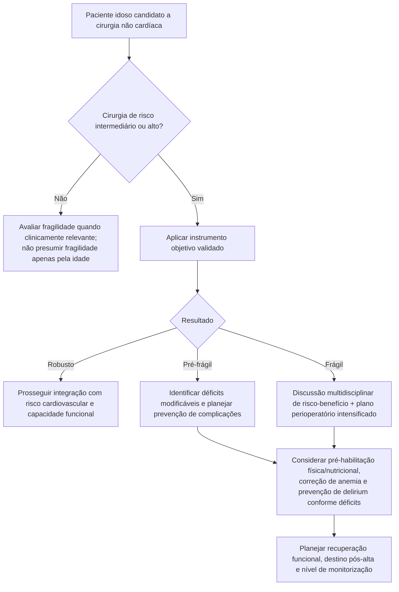

# Fragilidade no pré-operatório

A fragilidade é uma síndrome multidimensional de redução da reserva fisiológica e maior vulnerabilidade a estressores. Ela não é sinônimo de idade avançada, multimorbidade ou incapacidade funcional, embora possa coexistir com todas essas condições.

A SBC 2024 recomenda:

- avaliar rotineiramente fragilidade em idosos submetidos a cirurgia de risco intermediário ou alto — **Classe IIa, nível B**;
- mensurar fragilidade objetivamente com instrumento específico — **Classe IIa, nível C**.

## Árvore de decisão

## Instrumentos citados pela SBC 2024

A diretriz apresenta exemplos, sem declarar um único padrão-ouro universal:

### Fenótipo de Fragilidade Física

Cinco domínios: inatividade física, lentificação da marcha, perda de peso, fraqueza muscular e exaustão.

- **0:** robusto;
- **1–2:** pré-frágil;
- **≥3:** frágil.

### Clinical Frailty Scale (CFS)

Escala global de saúde e capacidade funcional de **1 a 9**.

- **1–3:** robusto;
- **4:** pré-frágil;
- **≥5:** frágil.

A Corvia deve direcionar para o instrumento oficial/validado quando a CFS for usada, sem reproduzir de forma não autorizada imagens ou descritores proprietários do material original.

### Essential Frailty Toolset (EFT)

Combina teste de sentar/levantar, cognição, albumina e hemoglobina. Na tabela SBC:

- **0:** robusto;
- **1–2:** pré-frágil;
- **≥3:** frágil.

### Índice de Fragilidade por acúmulo de déficits

Modelo multidimensional baseado na proporção de déficits presentes; a SBC relata que, em geral, valor **>0,25** é utilizado para definir fragilidade.

## O que fazer com o resultado

A fragilidade **não deve ser adicionada aritmeticamente ao RCRI, AUB-HAS2 ou VSG-CRI**. Ela funciona como modificador de risco e de planejamento assistencial.

Um resultado frágil pode justificar:

- revisão mais cuidadosa da relação risco-benefício;
- participação de geriatria/anestesia/cirurgia e demais áreas relevantes;
- pré-habilitação quando houver tempo;
- correção de anemia e déficits nutricionais quando apropriado;
- estratégias de prevenção e reconhecimento precoce de delirium;
- planejamento de reabilitação e necessidade de suporte após a alta.

## Regra prática

**Idade não é fragilidade.** No idoso, o objetivo é medir reserva fisiológica e vulnerabilidade de forma objetiva, acrescentando informação que os escores cardiovasculares tradicionais não fornecem.
