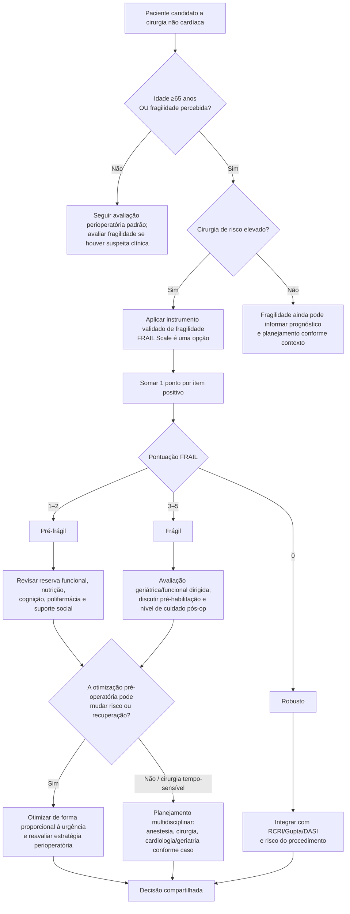

# FRAIL Scale no pré-operatório

A fragilidade mede **vulnerabilidade fisiológica ao estresse** e acrescenta informação que idade cronológica e escores cardiovasculares não capturam completamente. Na diretriz AHA/ACC 2024, a avaliação pré-operatória de fragilidade com instrumento validado **pode ser útil** em todos os pacientes **≥65 anos** e nos mais jovens com fragilidade percebida que serão submetidos a cirurgia não cardíaca de risco elevado (**Classe 2a, nível B-NR**).

A diretriz destaca que fragilidade se associa a complicações cardíacas e não cardíacas, declínio funcional, maior permanência hospitalar e mortalidade.

## FRAIL Scale — cinco perguntas

Cada item positivo vale 1 ponto:

1. **Fatigue — fadiga:** cansaço todo ou a maior parte do tempo nas últimas quatro semanas.
2. **Resistance — resistência:** dificuldade para subir 10 degraus sozinho, sem repouso e sem auxílio.
3. **Ambulation — deambulação:** dificuldade para caminhar várias centenas de jardas sozinho e sem auxílio.
4. **Illnesses — doenças:** cinco ou mais entre as 11 condições descritas na escala original: hipertensão, diabetes, câncer exceto câncer de pele menor, doença pulmonar crônica, infarto, insuficiência cardíaca, angina, asma, artrite, AVC e doença renal.
5. **Loss of weight — perda de peso:** redução ≥5% do peso nos últimos 12 meses.

Classificação:

- **0:** robusto;
- **1–2:** pré-frágil;
- **3–5:** frágil.

## Árvore de decisão

## Como usar junto aos demais métodos

A FRAIL Scale **não substitui**:

- RCRI, Gupta MICA, AUB-HAS2 ou GSCRI para risco cardiovascular;
- DASI para capacidade funcional;
- SORT/S-MPM para mortalidade cirúrgica global;
- avaliação de condições cardiovasculares instáveis que podem exigir pausa antes de cirurgia eletiva.

Ela acrescenta uma pergunta diferente: **quanto de reserva fisiológica e funcional este paciente tem para suportar o estresse cirúrgico e recuperar-se depois?**

## Evidência perioperatória resumida

Na diretriz AHA/ACC 2024, uma metanálise de 56 estudos e aproximadamente 1,1 milhão de adultos mais velhos submetidos a cirurgia não cardíaca associou fragilidade a maior mortalidade em 30 dias (**RR 3,71; IC95% 2,89–4,77**) e maior risco de complicações em 30 dias (**RR 2,39; IC95% 2,02–2,83**).

Essas razões de risco descrevem associação populacional e **não devem ser convertidas em probabilidade individual** para o paciente.

## Regra prática

**Fragilidade modifica o plano, não funciona como veto automático.** O resultado deve orientar objetivos do cuidado, possibilidade de pré-habilitação, estratégia anestésica/cirúrgica, mobilização, nutrição, prevenção de delirium e necessidade de monitorização/UTI quando clinicamente apropriado.
