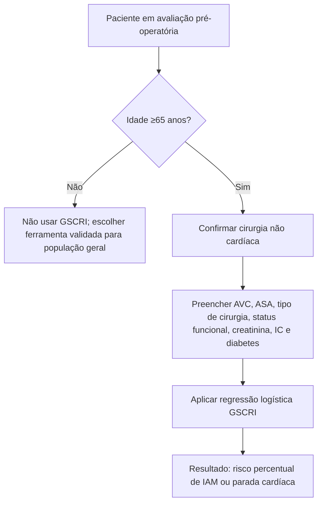
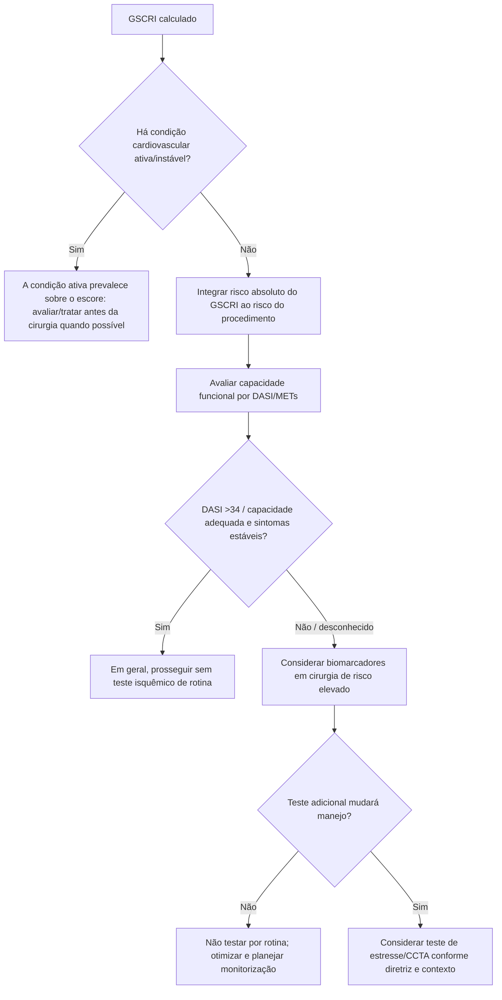

# GSCRI — Geriatric-Sensitive Perioperative Cardiac Risk Index

## Para quem foi desenvolvido

O GSCRI foi derivado especificamente para pacientes **com idade ≥65 anos** submetidos a cirurgia não cardíaca. O endpoint é **infarto do miocárdio ou parada cardíaca perioperatória (MICA)**.

A derivação utilizou o NSQIP 2013; a validação foi realizada no NSQIP 2012. Na população geriátrica de validação, o GSCRI apresentou **AUC 0,76**, contra **0,70** para Gupta MICA e **0,63** para RCRI.

## Variáveis do modelo

- história de AVC;
- classe ASA;
- categoria da cirurgia;
- status funcional;
- creatinina >1,5 mg/dL;
- história de insuficiência cardíaca;
- diabetes mellitus, distinguindo uso de insulina.

O modelo é uma regressão logística. A constante publicada é **−6,79** e os coeficientes individuais constam na Tabela 3 do artigo original.

## Árvore de elegibilidade

## Árvore de interpretação

## Coeficientes — transparência do cálculo

A calculadora interativa da Corvia utiliza exatamente os coeficientes da Tabela 3 da publicação:

- AVC: +2,08;
- ASA II +0,28; III +1,34; IV +2,04; V +3,63;
- status funcional parcialmente dependente +0,23; totalmente dependente +0,72;
- creatinina >1,5 mg/dL +0,57;
- IC +0,60;
- diabetes sem insulina +0,09; com insulina +0,47;
- os coeficientes da categoria cirúrgica variam de −1,14 (mama) a +1,35 (cirurgia venosa), tendo hérnia como referência.

Probabilidade = `exp(x) / [1 + exp(x)]`, com `x = −6,79 + soma dos coeficientes`.

## Por que não substituir todos os outros scores pelo GSCRI

O GSCRI é uma ferramenta **específica de geriatria**, com endpoint MICA. Ele não substitui:

- avaliação de fragilidade;
- DASI/capacidade funcional;
- biomarcadores quando indicados;
- avaliação de doença cardiovascular ativa;
- scores voltados a mortalidade geral ou complicações cirúrgicas não cardíacas.

## Mensagem prática

No paciente ≥65 anos, sobretudo frágil ou funcionalmente dependente, o GSCRI adiciona uma estimativa de risco mais alinhada à população geriátrica do que simplesmente aplicar o RCRI e assumir que sua calibração é idêntica em idosos.
