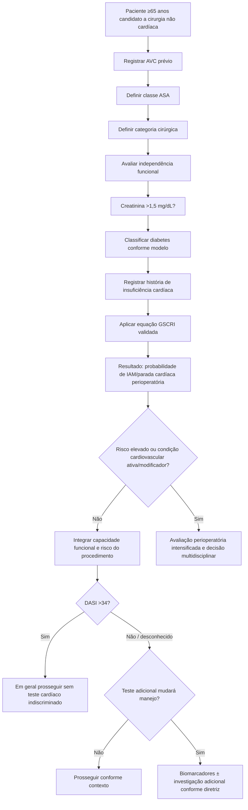

# GSCRI — Geriatric-Sensitive Cardiac Risk Index

O GSCRI foi desenvolvido especificamente para pacientes com **idade ≥65 anos** submetidos a cirurgia não cardíaca, com o objetivo de estimar risco de **infarto do miocárdio ou parada cardíaca perioperatória**.

A derivação usou 210.914 pacientes geriátricos do ACS-NSQIP 2013 e a validação 172.905 pacientes geriátricos do ACS-NSQIP 2012.

## Variáveis do modelo final

O modelo final utiliza sete grupos de informação:

- história de AVC;
- classe ASA;
- categoria cirúrgica;
- status funcional;
- creatinina >1,5 mg/dL;
- diabetes;
- história de insuficiência cardíaca.

## Árvore de decisão metodológica

## Desempenho na validação geriátrica

Na coorte de validação, a área sob a curva foi:

- **GSCRI: 0,76**;
- **Gupta MICA: 0,70**;
- **RCRI: 0,63**.

O estudo também relatou deterioração do desempenho do Gupta MICA e subestimação do risco quando aplicado ao subconjunto geriátrico.

## Por que não há calculadora local ativa ainda

A publicação confirma as sete variáveis e o desempenho do modelo, porém a transcrição integral dos coeficientes por categoria cirúrgica **não foi validada nesta sessão contra a tabela original completa**. Portanto, conforme a regra de governança da Corvia, a implementação matemática permanece:

**VERIFICAÇÃO HUMANA NECESSÁRIA**

Até essa validação, o GSCRI deve aparecer como metodologia científica/árvore de decisão, não como calculadora que produz um percentual potencialmente incorreto.

## Regra prática

Em pacientes ≥65 anos, o GSCRI é especialmente útil para lembrar que **dependência funcional, categoria cirúrgica e vulnerabilidade geriátrica** acrescentam informação que pode não ser capturada adequadamente pelo RCRI tradicional.
