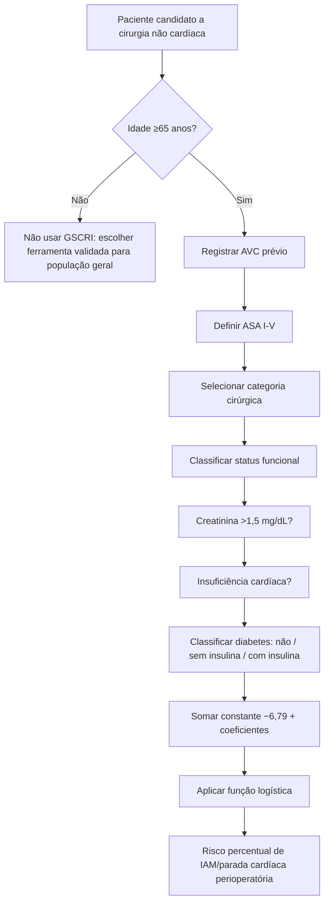
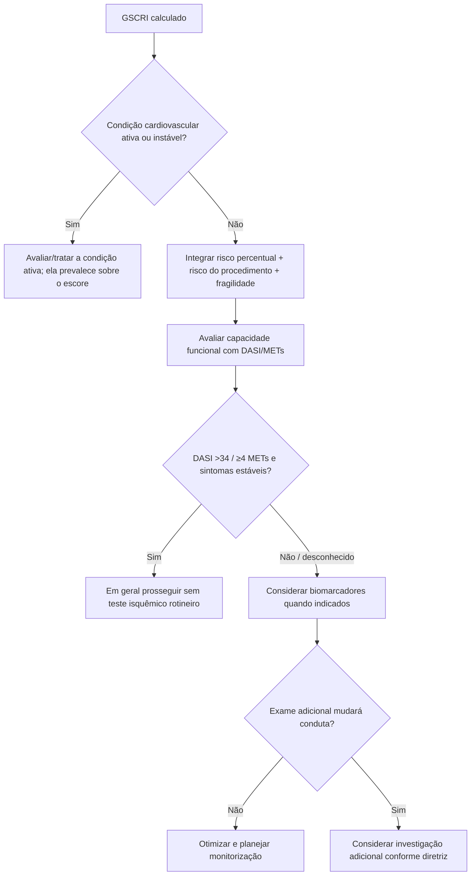

# GSCRI — Geriatric-Sensitive Cardiac Risk Index

O GSCRI foi desenvolvido especificamente para pacientes com **idade ≥65 anos** submetidos a cirurgia não cardíaca, com o objetivo de estimar risco de **infarto do miocárdio ou parada cardíaca perioperatória**.

A derivação usou 210.914 pacientes geriátricos do ACS-NSQIP 2013 e a validação 172.905 pacientes geriátricos do ACS-NSQIP 2012.

## Variáveis do modelo final

- história de AVC;
- classe ASA;
- categoria cirúrgica;
- status funcional;
- creatinina >1,5 mg/dL;
- diabetes, distinguindo uso de insulina;
- história de insuficiência cardíaca.

## Fórmula validada

O modelo é uma regressão logística com constante **−6,79**. A probabilidade é calculada por:

`p = exp(x) / [1 + exp(x)]`

onde `x = −6,79 + soma dos coeficientes aplicáveis`.

### Coeficientes clínicos

- AVC prévio: **+2,08**;
- ASA II: **+0,28**;
- ASA III: **+1,34**;
- ASA IV: **+2,04**;
- ASA V: **+3,63**;
- parcialmente dependente: **+0,23**;
- totalmente dependente: **+0,72**;
- creatinina >1,5 mg/dL: **+0,57**;
- insuficiência cardíaca: **+0,60**;
- diabetes sem insulina: **+0,09**;
- diabetes com insulina: **+0,47**.

### Coeficientes de categoria cirúrgica

Hérnia é a referência (0). Na Tabela 3 do estudo original:

- anorretal +1,02;
- aórtica +1,32;
- bariátrica +0,31;
- encefálica +0,24;
- mama −1,14;
- otorrinolaringológica +0,32;
- trato gastrointestinal alto/hepatopancreatobiliar +1,03;
- vesícula/apêndice/adrenal/baço ou intestinal +1,13;
- pescoço/tireoide/paratireoide −0,04;
- obstétrica/ginecológica +0,12;
- ortopédica/extremidade não vascular +0,47;
- abdominal outra +0,16;
- vascular periférica +0,82;
- pele/tecido subcutâneo +0,41;
- coluna +0,42;
- torácica não esofágica +1,06;
- venosa +1,35;
- urológica +0,55.

## Árvore de cálculo

## Árvore de uso clínico

## Desempenho na validação geriátrica

Na coorte de validação, a área sob a curva foi:

- **GSCRI: 0,76**;
- **Gupta MICA: 0,70**;
- **RCRI: 0,63**.

## Limitações

- Validado para **idade ≥65 anos**; não extrapolar para pacientes mais jovens.
- O endpoint é IAM/parada cardíaca, não mortalidade global.
- ASA e categoria cirúrgica dependem de classificação correta.
- Fragilidade, capacidade funcional e doença cardiovascular ativa não são substituídas pelo modelo.
- O percentual não constitui, isoladamente, indicação de teste de estresse, CCTA, coronariografia ou adiamento da cirurgia.

## Regra prática

No paciente ≥65 anos, o GSCRI acrescenta uma estimativa especificamente calibrada para a população geriátrica. A calculadora interativa da Corvia usa os coeficientes da **Tabela 3 do artigo original**, e não uma reprodução secundária.