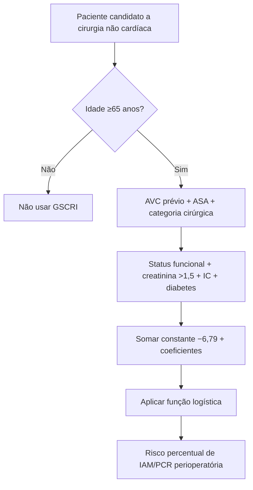
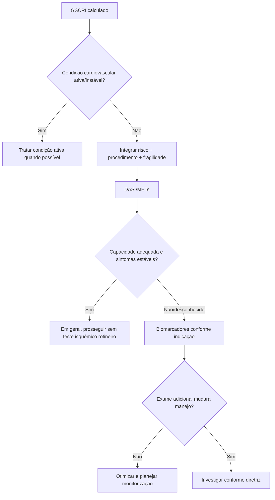

# GSCRI — Geriatric-Sensitive Cardiac Risk Index

Desenvolvido para pacientes **≥65 anos** submetidos a cirurgia não cardíaca, estimando **IAM ou parada cardíaca perioperatória**. Derivação: 210.914 pacientes geriátricos do ACS-NSQIP 2013; validação: 172.905 do ACS-NSQIP 2012.

## Fórmula

`p = exp(x) / [1 + exp(x)]`, com constante **−6,79**.

Coeficientes clínicos da Tabela 3: AVC +2,08; ASA II +0,28, III +1,34, IV +2,04, V +3,63; parcialmente dependente +0,23; totalmente dependente +0,72; creatinina >1,5 mg/dL +0,57; IC +0,60; diabetes sem insulina +0,09; com insulina +0,47.

Coeficientes cirúrgicos, com hérnia como referência: anorretal +1,02; aórtica +1,32; bariátrica +0,31; encefálica +0,24; mama −1,14; ORL +0,32; GI alto/HPB +1,03; vesícula/apêndice/adrenal/baço ou intestinal +1,13; pescoço −0,04; obstétrica/ginecológica +0,12; ortopédica +0,47; abdominal outra +0,16; vascular periférica +0,82; pele +0,41; coluna +0,42; torácica +1,06; venosa +1,35; urológica +0,55.

## Árvore de cálculo

## Árvore de uso clínico

## Desempenho na validação geriátrica

- GSCRI: **AUC 0,76**;
- Gupta MICA: **0,70**;
- RCRI: **0,63**.

## Limitações

Validado apenas para idade ≥65; endpoint é IAM/PCR, não mortalidade global. ASA e categoria cirúrgica devem ser classificadas corretamente. Fragilidade, capacidade funcional e doença cardiovascular ativa continuam necessárias. O resultado não é indicação automática de teste de estresse, CCTA, coronariografia ou adiamento cirúrgico.

## Regra prática

A calculadora interativa da Corvia usa os coeficientes da **Tabela 3 do artigo original**, não uma reprodução secundária.