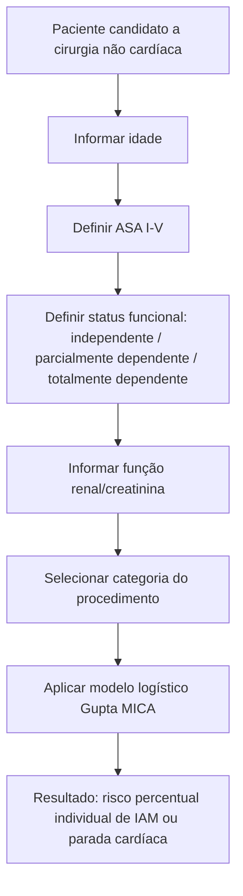
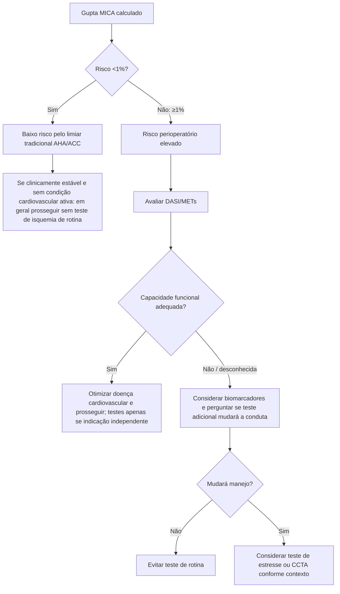

# Gupta MICA

## Endpoint

O Gupta MICA estima a probabilidade de **infarto do miocárdio ou parada cardíaca** no período perioperatório de cirurgia não cardíaca.

No estudo original, 211.410 pacientes do ACS-NSQIP 2007 compuseram a coorte de desenvolvimento; 1.371 (0,65%) apresentaram IAM ou parada cardíaca. O modelo foi validado em 257.385 pacientes do NSQIP 2008.

## Variáveis

O modelo utiliza cinco componentes:

- idade;
- classe ASA;
- status funcional pré-operatório;
- creatinina;
- tipo de procedimento cirúrgico.

O desempenho discriminatório foi alto no estudo original: estatística C de **0,884** na derivação e **0,874** na validação; no mesmo conjunto de validação, o RCRI teve estatística C de **0,747**.

## Árvore metodológica

## Árvore de interpretação para a Corvia

## Vantagens em relação ao RCRI

- Produz **risco percentual contínuo**, não apenas classe ordinal.
- Incorpora idade e dependência funcional.
- Possui granularidade maior por tipo de cirurgia.
- Teve discriminação superior ao RCRI na validação original.

## Limitações

- A classificação correta do procedimento é essencial; aproximar uma cirurgia incomum à categoria errada pode alterar o risco.
- A classe ASA possui componente de julgamento clínico.
- O modelo não substitui a avaliação de sintomas, capacidade funcional, fragilidade, biomarcadores ou doença cardiovascular ativa.
- A indicação de teste adicional deve depender de probabilidade de mudança de manejo, e não do percentual isoladamente.

## Nota de implementação

A calculadora já existente na Corvia deve sempre exibir junto ao resultado: **endpoint previsto (IAM/PCR), horizonte temporal, variáveis utilizadas e limitação do enquadramento do procedimento**.
