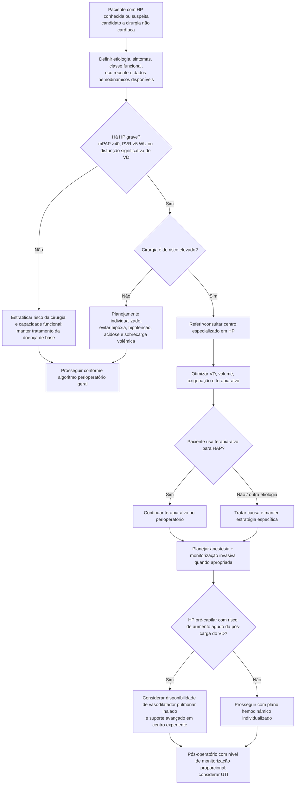

# Hipertensão pulmonar no pré-operatório

Hipertensão pulmonar (HP) é um modificador de risco que frequentemente não é representado de forma adequada por escores como RCRI ou Gupta MICA. O principal determinante perioperatório é a capacidade do **ventrículo direito (VD)** de sustentar débito diante de aumento de pós-carga pulmonar, alterações de pré-carga, ventilação mecânica, hipóxia, acidose e hipotensão sistêmica.

## Quando a AHA/ACC 2024 considera HP grave

A diretriz descreve HP grave quando existe componente hemodinâmico importante, incluindo um ou mais dos seguintes:

- pressão média da artéria pulmonar (**mPAP >40 mmHg**);
- resistência vascular pulmonar (**PVR >5 Wood units**);
- evidência ecocardiográfica de disfunção significativa de VD, por exemplo:
  - relação diâmetro diastólico VD/VE >0,8; ou
  - disfunção de VD moderada ou grave.

Esses valores não substituem avaliação clínica, classe funcional, biomarcadores, teste de exercício e contexto etiológico.

## Recomendações centrais AHA/ACC 2024

- Pacientes com **HAP em terapia-alvo estável** devem **continuar os medicamentos específicos** no perioperatório — Classe 1, C-LD.
- Pacientes com **HP grave** submetidos a cirurgia não cardíaca de risco elevado: encaminhamento/consulta com **centro especializado em HP** é razoável — Classe 2a, C-LD.
- Nessa população, **monitorização hemodinâmica invasiva** é razoável para guiar cuidado intra e pós-operatório — Classe 2a, C-LD.
- Em HP pré-capilar submetida a cirurgia de risco elevado, vasodilatadores pulmonares inalados de curta ação, como óxido nítrico ou prostaciclinas inaladas, **podem ser considerados** para reduzir pós-carga do VD — Classe 2b, C-EO.

## Árvore de decisão

## O que evitar fisiologicamente

No paciente com HP importante e VD vulnerável, deterioração pode ser precipitada por:

- hipóxia;
- hipercapnia e acidose;
- hipotensão sistêmica, reduzindo perfusão coronária do VD;
- taquiarritmia e perda de sincronia AV;
- sobrecarga de volume ou redução excessiva de pré-carga;
- aumento abrupto de pressão intratorácica/pós-carga do VD.

A estratégia anestésica e ventilatória deve ser construída em torno dessa fisiologia, não apenas do valor estimado de pressão pulmonar.

## Dados prognósticos citados pela diretriz

Em levantamento prospectivo internacional de pacientes com HAP submetidos a cirurgia não cardíaca/não obstétrica, complicações maiores ocorreram em **6,1%** e mortalidade perioperatória em **3,5%**. A mortalidade foi **15% em procedimentos de emergência** versus **2% em cirurgias não emergenciais**.

Esses números descrevem a coorte e não devem ser usados como risco individual calculado.

## Regra prática

**HP grave não é “mais um fator de risco”: é um problema de VD e reserva circulatória.** Quanto maior a gravidade da HP e o risco da cirurgia, maior a necessidade de centro experiente, plano hemodinâmico explícito e estratégia de resgate definida antes da indução anestésica.
