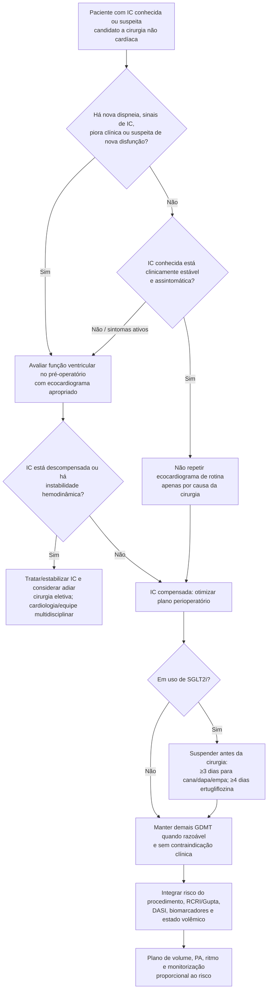

# Insuficiência cardíaca no pré-operatório

Insuficiência cardíaca (IC) é um dos modificadores prognósticos mais importantes em cirurgia não cardíaca. O risco não depende apenas da FEVE: **sintomas atuais, compensação clínica, classe funcional, tipo de cirurgia e comorbidades** importam de forma substancial.

A pergunta inicial é: **o paciente está estável ou descompensado?**

## Árvore de decisão

## Quando avaliar função ventricular

A AHA/ACC 2024 recomenda avaliação pré-operatória da função ventricular em pacientes com:

- **nova dispneia**;
- achados ao exame físico sugestivos de IC;
- suspeita de disfunção ventricular nova ou piora — Classe 1, B-NR.

Em paciente com IC conhecida e **piora da dispneia ou mudança do estado clínico**, reavaliar função ventricular é razoável — Classe 2a, C-LD.

Em paciente **assintomático e clinicamente estável**, repetir função ventricular de rotina antes da cirurgia **não traz benefício** — Classe 3: No Benefit, B-NR.

## Risco conforme FEVE e sintomas

A diretriz resume uma grande coorte de pacientes submetidos a cirurgia não cardíaca em que a mortalidade em 90 dias aumentou progressivamente conforme a função ventricular piorou:

| Situação | Mortalidade bruta em 90 dias | OR ajustado vs sem IC |
|---|---:|---:|
| Sem IC | 1,22% | referência |
| IC com FEVE ≥50% | 4,88% | 1,51 |
| FEVE 40–49% | 5,11% | 1,53 |
| FEVE 30–39% | 6,58% | 1,85 |
| FEVE <30% | 8,34% | 2,35 |

Esses valores são observacionais e não são uma calculadora individual; servem para demonstrar o gradiente de risco.

Pacientes com IC **sintomática** apresentam risco maior que pacientes compensados, mesmo quando a FEVE é semelhante.

## GDMT no perioperatório

Em pacientes com IC compensada, é razoável continuar a terapia dirigida por diretriz durante o perioperatório, **exceto SGLT2i**, quando não houver contraindicação clínica específica.

Isso evita suspensão reflexa de fármacos importantes apenas porque o paciente será operado.

## SGLT2i — exceção importante

A AHA/ACC 2024 recomenda suspender SGLT2i antes de cirurgia eletiva quando possível para reduzir risco de acidose metabólica/cetoacidose euglicêmica:

- canagliflozina: **≥3 dias**;
- dapagliflozina: **≥3 dias**;
- empagliflozina: **≥3 dias**;
- ertugliflozina: **≥4 dias**.

O risco de cetoacidose pode ocorrer com glicemia normal ou apenas discretamente aumentada; náuseas, dor abdominal, dispneia e acidose com ânion gap devem levantar suspeita.

## Quando considerar pausa da cirurgia eletiva

Pacientes com IC avançada, especialmente NYHA III–IV, **clinicamente descompensados ou hemodinamicamente instáveis**, devem ter estabilização e consulta cardiológica consideradas antes de cirurgia eletiva.

A decisão deve ponderar:

- urgência da cirurgia;
- congestão e perfusão;
- necessidade de diurese/vasoativo/inotrópico;
- arritmias;
- função renal e eletrólitos;
- biomarcadores;
- possibilidade de otimização real antes do procedimento.

## Regra prática

**Não peça ecocardiograma porque o paciente “tem IC”; peça quando a informação atualizada pode mudar o manejo.** Em IC compensada, preserve GDMT quando possível; em IC descompensada, trate a instabilidade primeiro; e lembre que SGLT2i é a principal exceção de rotina, devendo ser suspenso 3–4 dias antes da cirurgia programada.
