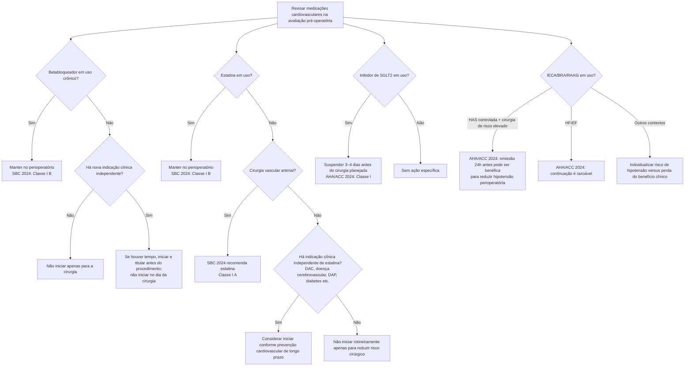

# Medicações cardiovasculares no perioperatório

O manejo medicamentoso deve distinguir **tratamento crônico que deve ser mantido**, terapias que precisam ser suspensas temporariamente por risco perioperatório e fármacos que não devem ser iniciados de forma abrupta apenas para “proteger” a cirurgia.

## Árvore geral

# Betabloqueadores

A SBC 2024 recomenda:

- **manter** betabloqueador em pacientes em uso crônico — **Classe I, nível B**;
- **não iniciar** betabloqueador em paciente previamente não tratado no intervalo de até **7 dias antes da cirurgia** — **Classe III, nível B**.

A AHA/ACC 2024 é concordante em manter terapia crônica e afirma que, quando existe uma nova indicação legítima, o início deve ocorrer com antecedência suficiente para avaliar tolerância e titular a dose, **idealmente >7 dias**. Iniciar no dia da cirurgia sem necessidade imediata é prejudicial.

## Regra de segurança

Uso crônico de betabloqueador não deve ser suspenso abruptamente por rotina; por outro lado, o fármaco não deve ser iniciado de última hora apenas porque o risco cirúrgico é alto.

# Estatinas

A SBC 2024 recomenda:

- pacientes submetidos a **operações vasculares arteriais**: estatina — **Classe I, nível A**;
- pacientes que já usam estatina: **manter** — **Classe I, nível B**;
- cirurgia não vascular com indicação clínica independente por DAC, doença cerebrovascular, DAP ou diabetes: uso é **Classe IIa, nível C**.

A introdução de estatina apenas para toda e qualquer cirurgia não vascular, na ausência de indicação clínica, não é recomendação de rotina.

# Inibidores de SGLT2

A AHA/ACC 2024 recomenda interromper inibidores de SGLT2 **3–4 dias antes de cirurgia planejada** para reduzir o risco de acidose metabólica/cetoacidose euglicêmica perioperatória.

Isso se aplica ao uso por diabetes e/ou insuficiência cardíaca. A suspensão deve ser temporária e a reintrodução deve considerar estabilidade clínica e metabólica no pós-operatório.

# IECA/BRA e outros bloqueadores do SRAA

A AHA/ACC 2024 diferencia a indicação:

- em pacientes selecionados tratados por **hipertensão controlada** e submetidos a cirurgia de risco elevado, omitir o bloqueador do SRAA **24 horas antes** pode reduzir hipotensão intraoperatória;
- em pacientes que usam o fármaco como parte do tratamento de **IC com fração de ejeção reduzida**, a continuação perioperatória é razoável.

A SBC 2024 enfatiza que a evidência para manter versus suspender IECA/BRA não é definitiva e que a decisão deve ser individualizada, com atenção à hipotensão e à reintrodução pós-operatória.

## Regra prática

**A mesma classe farmacológica pode ter conduta diferente conforme a indicação.** O formulário pré-operatório deve perguntar não apenas “qual medicamento o paciente usa?”, mas também “por que ele usa?”.
