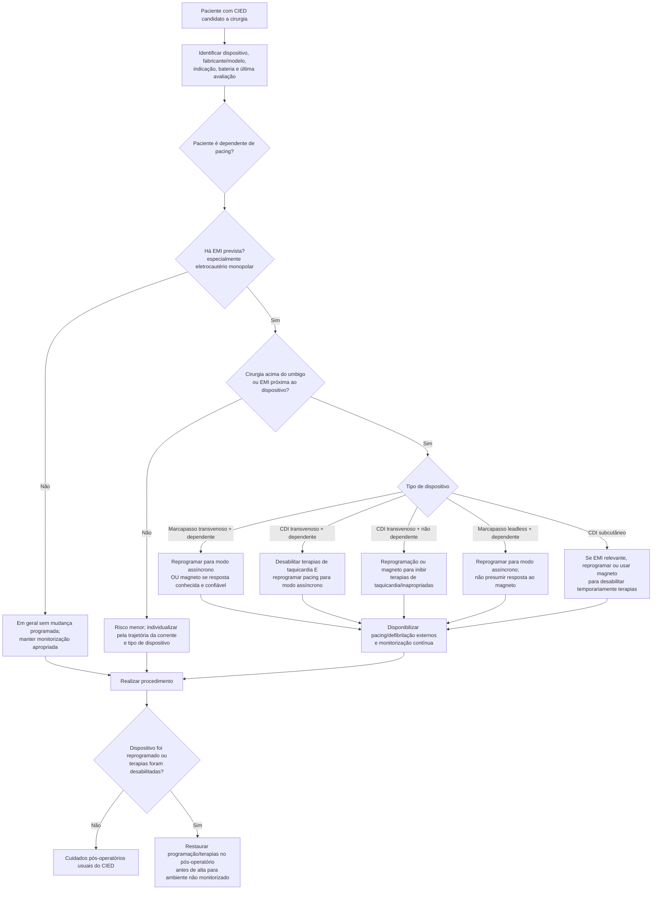

# CIED no perioperatório

Pacientes com marcapasso, CDI, ressincronizador, marcapasso sem eletrodo ou CDI subcutâneo precisam de um **plano do dispositivo**, não apenas de uma anotação “portador de MP/CDI”.

Antes da cirurgia, é necessário esclarecer:

- tipo de dispositivo;
- fabricante e modelo;
- indicação do implante;
- dependência de estimulação;
- resposta específica ao magneto;
- estado da bateria e funcionamento recente;
- local da cirurgia e uso previsto de fonte de interferência eletromagnética (EMI).

## Regra central AHA/ACC 2024

Em cirurgia eletiva com possibilidade de EMI, deve existir plano prévio de manejo do CIED — Classe 1, B-NR.

A EMI é particularmente relevante com eletrocautério monopolar e quando a fonte está próxima ao gerador/eletrodos. Cirurgias abaixo do umbigo geralmente apresentam risco menor de EMI para sistemas transvenosos, mas a geometria do circuito e a placa dispersiva continuam relevantes.

## Árvore de decisão

## Pontos críticos por dispositivo

### Marcapasso transvenoso

Em paciente **dependente de pacing** submetido a cirurgia **acima do umbigo** com EMI prevista, a AHA/ACC recomenda reprogramação ou magneto capaz de produzir modo assíncrono para evitar inibição de pacing.

Mas o magneto só é seguro se a resposta daquele dispositivo for conhecida. Respostas variam por fabricante, modelo, programação e bateria.

### CDI transvenoso

A EMI pode ser interpretada como taquiarritmia e disparar terapias inadequadas.

- se o paciente é dependente de pacing: desabilitar terapias de taquicardia **e** garantir pacing assíncrono;
- se não é dependente: reprogramação ou magneto podem ser usados para impedir terapias inadequadas.

**Magneto sobre CDI não transforma automaticamente o pacing em modo assíncrono.**

### Marcapasso leadless

A resposta ao magneto é dependente do fabricante/modelo e pode não existir. Em paciente dependente submetido a cirurgia acima do umbigo com EMI, a diretriz recomenda reprogramação para modo assíncrono.

### CDI subcutâneo

Para cirurgia com EMI relevante acima da virilha, reprogramação ou magneto para suspensão temporária das terapias é razoável.

## Durante a cirurgia

Quando terapias de CDI estiverem desativadas ou pacing tiver sido alterado:

- monitorização cardíaca contínua;
- disponibilidade imediata de desfibrilação externa;
- considerar pads de pacing/desfibrilação já posicionados quando apropriado;
- usar eletrocautério bipolar/ultrassônico quando possível;
- com monopolar, usar menor energia eficaz e rajadas curtas/intermitentes;
- posicionar placa dispersiva de forma que a corrente não atravesse o gerador/eletrodos.

## Passo pós-operatório que não pode ser esquecido

Pacientes cujo CDI teve terapias desativadas ou cujo marcapasso/CDI foi reprogramado precisam ter a função **restaurada antes da alta para ambiente sem monitorização**.

A falha de reativar terapias de CDI após cirurgia já foi associada a mortes evitáveis.

## Regra prática

**O magneto não é uma solução universal.** O plano seguro depende de três perguntas: o paciente depende de pacing? haverá EMI relevante? o que exatamente esse dispositivo faz quando recebe um magneto? A quarta pergunta é obrigatória depois: **quem vai restaurar a programação antes da alta?**
