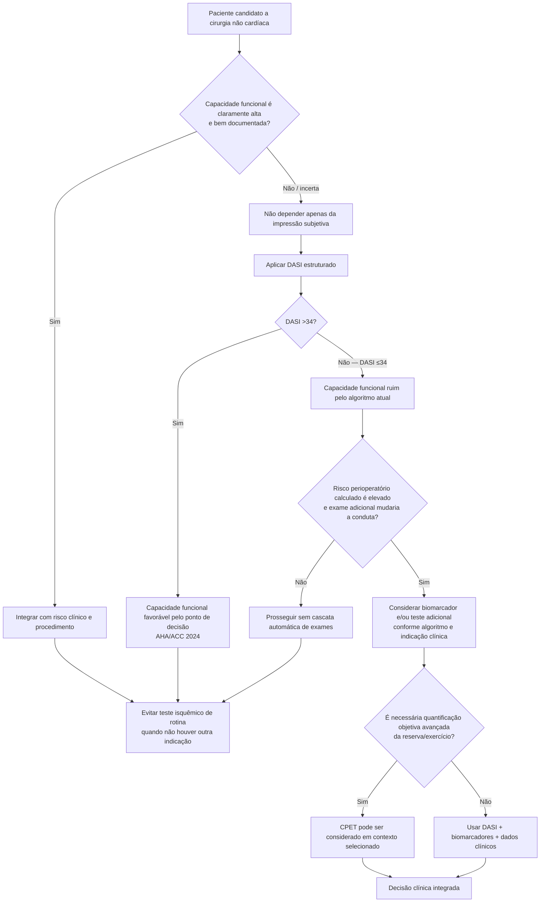

# METS Study — Measurement of Exercise Tolerance before Surgery

A capacidade funcional sempre foi parte central da avaliação pré-operatória, mas por muitos anos foi estimada pela pergunta informal: **“o paciente consegue fazer mais de 4 METs?”**.

O METS Study testou se essa avaliação subjetiva realmente identifica capacidade funcional e prediz eventos melhor que métodos estruturados.

## Desenho

Estudo prospectivo, internacional e multicêntrico realizado em **25 hospitais** do Canadá, Reino Unido, Austrália e Nova Zelândia.

Foram incluídos **1.401 pacientes** com idade ≥40 anos, candidatos a cirurgia não cardíaca maior e com pelo menos um fator de risco cardiovascular relevante ou doença coronariana.

Antes da cirurgia, todos passaram por:

- estimativa subjetiva da capacidade funcional pelo anestesiologista;
- **Duke Activity Status Index (DASI)**;
- teste cardiopulmonar de exercício (**CPET**), incluindo VO₂ de pico;
- dosagem de **NT-proBNP**.

No pós-operatório, houve vigilância estruturada com ECG, troponina e creatinina até o terceiro dia ou alta.

O desfecho primário foi **morte ou infarto do miocárdio em 30 dias**.

## Resultados

Ocorreram **28 eventos primários (2%)** entre 1.401 pacientes.

A estimativa subjetiva do médico apresentou apenas:

- sensibilidade **19,2%** — IC95% 14,2–25,0;
- especificidade **94,7%** — IC95% 93,2–95,9;

para identificar incapacidade de atingir **4 METs** no CPET.

Ou seja: quando o médico classificava alguém como “capacidade funcional ruim”, geralmente estava correto, mas **muitos pacientes com baixa capacidade objetiva não eram reconhecidos pela avaliação subjetiva**.

Entre as medidas de capacidade avaliadas, o **DASI foi associado ao desfecho primário**:

- OR ajustado por incremento do escore: **0,96**;
- IC95% **0,83–0,99**;
- P=0,03.

A conclusão dos autores foi que a avaliação subjetiva da capacidade funcional **não deveria ser usada isoladamente** para avaliação de risco pré-operatório e que medidas estruturadas, como o DASI, deveriam ser consideradas.

## Árvore de decisão derivada da metodologia

## O que o METS não demonstrou

O estudo não diz que CPET seja inútil. Ele mostra que, na população avaliada, **a impressão subjetiva do clínico foi uma medida fraca de capacidade objetiva e risco**, e que um questionário simples como DASI ofereceu informação prognóstica útil.

CPET continua tendo aplicações selecionadas, especialmente quando uma medida fisiológica detalhada pode mudar planejamento cirúrgico, anestésico ou de terapia intensiva.

## Relação com a AHA/ACC 2024

A diretriz atual incorporou avaliação estruturada da capacidade funcional e usa **DASI ≤34** como um dos critérios de capacidade funcional ruim no algoritmo de decisão sobre investigação adicional.

A sequência correta é:

1. estimar risco perioperatório com método validado;
2. medir capacidade funcional de forma estruturada quando ela é relevante;
3. só considerar investigação adicional se o risco for elevado, a capacidade for ruim/desconhecida e o resultado puder modificar manejo.

## Regra prática

**“Parece ativo” não é uma medida suficientemente sensível de capacidade funcional.** Quando essa informação pode mudar a conduta, prefira DASI estruturado a uma estimativa informal de METs.
