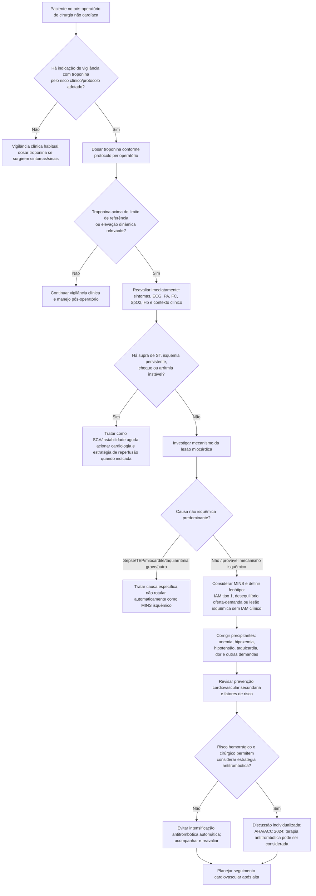

# MINS — myocardial injury after noncardiac surgery

A elevação de troponina após cirurgia não cardíaca é frequente e muitas vezes **clinicamente silenciosa**. O conceito de MINS procura identificar lesão miocárdica de provável mecanismo isquêmico relacionada ao período perioperatório, mesmo quando o paciente não apresenta dor torácica ou alterações eletrocardiográficas clássicas.

O primeiro passo diante de troponina elevada, porém, não é rotular automaticamente MINS: é **confirmar o padrão temporal e procurar causas isquêmicas e não isquêmicas de lesão miocárdica**.

## O que o VISION mostrou

Na análise JAMA 2017 do VISION, **21.842 pacientes com idade ≥45 anos** submetidos a cirurgia não cardíaca com internação tiveram hs-cTnT medida 6–12 horas após a cirurgia e diariamente nos primeiros três dias.

A mortalidade em 30 dias aumentou progressivamente com o pico pós-operatório de hs-cTnT:

| Pico de hs-cTnT | Mortalidade em 30 dias |
|---|---:|
| <20 ng/L | 0,5% |
| 20 a <65 ng/L | 3,0% |
| 65 a <1000 ng/L | 9,1% |
| ≥1000 ng/L | 29,6% |

No estudo, um padrão de **hs-cTnT 20 a <65 ng/L com aumento absoluto ≥5 ng/L**, ou **hs-cTnT ≥65 ng/L**, associou-se de forma importante à mortalidade em 30 dias mesmo sem manifestação isquêmica clínica típica.

**Importante:** esses pontos de corte são específicos da metodologia de hs-cTnT empregada no VISION e **não devem ser transplantados automaticamente para todos os ensaios de troponina**.

Entre os pacientes classificados como MINS no VISION, a grande maioria não apresentou sintomas isquêmicos. Isso sustenta a importância de uma estratégia de vigilância selecionada em pacientes perioperatórios de maior risco.

## Árvore de decisão — troponina pós-operatória elevada

## Diferencial de troponina elevada no pós-operatório

Troponina elevada significa **lesão miocárdica**, não necessariamente trombose coronária. A investigação deve integrar, entre outros:

- síndrome coronariana aguda;
- desequilíbrio entre oferta e demanda de oxigênio — hipotensão, anemia, hipoxemia, taquicardia;
- embolia pulmonar;
- sepse/choque distributivo;
- insuficiência cardíaca aguda;
- taquiarritmia sustentada;
- miocardite ou outras causas de lesão miocárdica, conforme o contexto.

## O que fazer após MINS estável

A AHA/ACC 2024 reconhece MINS como marcador de risco aumentado e recomenda uma abordagem etiológica e de prevenção cardiovascular. Entre as recomendações da diretriz:

- **seguimento cardiovascular ambulatorial é razoável** após MINS;
- **terapia antitrombótica pode ser considerada** em pacientes selecionados, após ponderação do risco hemorrágico e do contexto cirúrgico.

Isso não significa anticoagular rotineiramente todo paciente com troponina elevada.

## MANAGE — por que o estudo importa

O MANAGE randomizou pacientes com MINS para **dabigatrana 110 mg por via oral duas vezes ao dia** ou placebo. O estudo mostrou redução do desfecho vascular composto com dabigatrana sem sinal de aumento significativo do desfecho principal de segurança hemorrágica na comparação do ensaio.

A interpretação correta é:

- o MANAGE fornece evidência de que uma estratégia antitrombótica pode beneficiar **pacientes selecionados com MINS**;
- a dose de dabigatrana é a **intervenção testada no ensaio**, não uma prescrição automática para qualquer elevação de troponina;
- decisão depende de hemostasia cirúrgica, função renal, risco hemorrágico, mecanismo provável da lesão, interações e contraindicações.

## Regra prática

**Troponina elevada no pós-operatório exige uma pergunta causal antes de uma prescrição.** Primeiro diferencie SCA/instabilidade, desequilíbrio oferta-demanda e causas não isquêmicas. Depois, no MINS estável, trate precipitantes, reavalie prevenção cardiovascular e planeje seguimento; antitrombótico é decisão individualizada, não reflexo automático de um valor de troponina.
