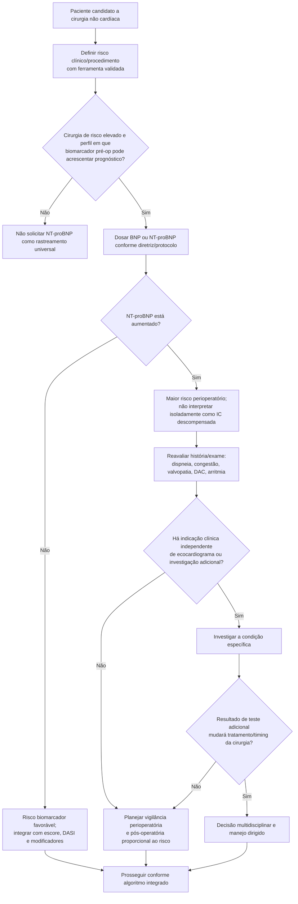

# NT-proBNP antes de cirurgia não cardíaca

O NT-proBNP acrescenta informação prognóstica independente à avaliação pré-operatória. Seu principal valor nesse contexto não é “diagnosticar insuficiência cardíaca” a partir de um número isolado, e sim ajudar a identificar pacientes com **maior risco de eventos cardiovasculares perioperatórios** que podem se beneficiar de planejamento e vigilância mais intensos.

## Estudo prospectivo de 10.402 pacientes

O estudo publicado no *Annals of Internal Medicine* avaliou **10.402 adultos com idade ≥45 anos** submetidos a cirurgia não cardíaca com internação.

O desfecho primário foi um composto de **morte de causa vascular ou myocardial injury after noncardiac surgery (MINS)** em 30 dias.

Em comparação com NT-proBNP <100 ng/L, o risco aumentou progressivamente:

| NT-proBNP pré-operatório | Incidência do desfecho primário | Hazard ratio ajustado vs <100 ng/L |
|---|---:|---:|
| <100 ng/L | VERIFICAÇÃO HUMANA NECESSÁRIA | referência |
| 100 a <200 ng/L | 12,3% | 2,27 |
| 200 a <1500 ng/L | 20,8% | 3,63 |
| ≥1500 ng/L | 37,5% | 5,82 |

A mortalidade em 30 dias também aumentou entre os quatro estratos de NT-proBNP, aproximadamente:

- <100 ng/L: **0,3%**;
- 100 a <200 ng/L: **0,7%**;
- 200 a <1500 ng/L: **1,4%**;
- ≥1500 ng/L: **4,0%**.

O estudo mostrou uma relação graduada: quanto maior o NT-proBNP pré-operatório, maior a frequência de eventos cardiovasculares e morte em 30 dias.

**Nota de governança:** o percentual exato do desfecho primário no grupo NT-proBNP <100 ng/L não foi preservado na fonte consultada desta sessão; por isso permanece como `VERIFICAÇÃO HUMANA NECESSÁRIA` em vez de ser completado por inferência.

## Árvore de decisão — como usar NT-proBNP

## Ponto de decisão da diretriz versus estratos do estudo

É importante não misturar duas funções diferentes do biomarcador:

### 1. Estratos prognósticos do estudo

Os grupos **<100**, **100–<200**, **200–<1500** e **≥1500 ng/L** foram usados para demonstrar a relação entre NT-proBNP e eventos em uma grande coorte prospectiva.

Eles ajudam a explicar **gradiente de risco**.

### 2. Ponto de decisão no algoritmo AHA/ACC 2024

A figura de decisão da AHA/ACC 2024 utiliza **NT-proBNP ≥300 ng/L** e **BNP >92 ng/L** como valores anormais no algoritmo perioperatório.

Esse ponto de decisão não transforma todos os pacientes acima de 300 ng/L em indicação automática de teste de estresse, coronariografia, adiamento cirúrgico ou ecocardiograma.

## O que um valor elevado deve mudar

Dependendo do contexto, NT-proBNP elevado pode justificar:

- revisão mais cuidadosa de insuficiência cardíaca, doença valvar, arritmia e doença coronariana;
- maior atenção à hemodinâmica e ao balanço volêmico;
- planejamento de vigilância pós-operatória, inclusive troponina quando indicada;
- discussão do local e intensidade de monitorização no pós-operatório;
- otimização clínica quando houver doença cardiovascular tratável.

O que **não** deve fazer isoladamente:

- diagnosticar IC sem clínica/imagem;
- indicar revascularização coronária;
- cancelar cirurgia;
- gerar uma falsa equivalência com RCRI, Gupta MICA ou SORT.

## Regra prática

**NT-proBNP é um amplificador de informação prognóstica, não um “teste de liberação cirúrgica”.** O valor deve modificar a intensidade da avaliação e da vigilância quando isso puder melhorar o manejo, e não criar uma cascata automática de exames.
