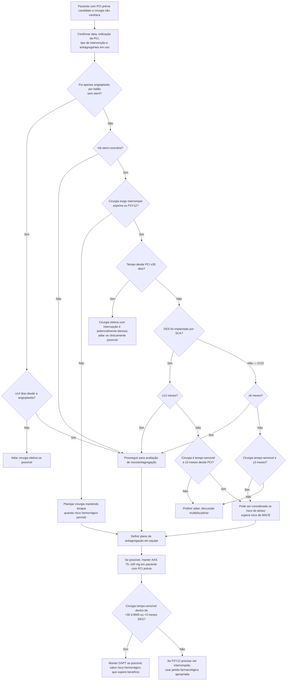

# Cirurgia não cardíaca após PCI

O risco perioperatório após PCI depende de quatro informações que precisam aparecer no formulário pré-operatório:

1. **quando** a PCI foi realizada;
2. se houve **balão sem stent, BMS ou DES**;
3. se a indicação foi **síndrome coronariana aguda (SCA)** ou **doença coronária crônica (CCD)**;
4. se a cirurgia exige **interromper um ou mais antiagregantes**.

O simples rótulo “tem stent” é insuficiente.

## Timing recomendado pela AHA/ACC 2024

### Angioplastia por balão sem stent

Cirurgia não cardíaca eletiva deve ser adiada por **pelo menos 14 dias**.

### DES implantado por síndrome coronariana aguda

Se a cirurgia eletiva exige interrupção de pelo menos um antiagregante, o ideal é adiar por **≥12 meses** após a PCI.

### DES implantado por doença coronária crônica

Se a cirurgia eletiva exige interrupção de antiagregação, é razoável adiar por **≥6 meses**.

### Cirurgia tempo-sensível após DES

Quando atrasar a cirurgia traz risco clínico relevante e será necessário interromper antiagregação, a cirurgia **pode ser considerada a partir de ≥3 meses** após PCI em pacientes selecionados, após ponderar MACE versus consequência do atraso.

### Primeiros 30 dias após qualquer stent

Cirurgia eletiva que exija interrupção de um ou mais antiagregantes em paciente com BMS ou DES implantado há **≤30 dias** é considerada **potencialmente danosa** pelo alto risco de trombose do stent e complicações isquêmicas.

## Árvore de decisão

## Continuação de aspirina e DAPT

AHA/ACC 2024 recomenda, em pacientes com PCI prévia submetidos a cirurgia não cardíaca:

- **continuar aspirina 75–100 mg, se possível**, para reduzir eventos cardíacos;
- em cirurgia tempo-sensível dentro de **30 dias de PCI com BMS** ou **<3 meses de PCI com DES**, **DAPT deve ser mantida** quando o risco cirúrgico de sangramento permitir;
- em situações selecionadas de muito alto risco trombótico após PCI, ponte com antiagregante intravenoso **pode ser considerada**, mas a evidência é limitada e exige equipe especializada.

## Tempo mínimo aproximado após interrupção para recuperação plaquetária

A tabela da AHA/ACC 2024 apresenta:

| Fármaco | Tempo mínimo da interrupção até recuperação da função plaquetária |
|---|---:|
| Aspirina | 4 dias |
| Clopidogrel | 5–7 dias |
| Prasugrel | 7–10 dias |
| Ticagrelor | 3–5 dias |

Esses intervalos **não são uma ordem automática para interromper**. Primeiro decide-se se a interrupção é aceitável; somente depois se aplica a janela farmacológica.

## Situações que exigem discussão multidisciplinar

- cirurgia oncológica ou outra cirurgia tempo-sensível;
- PCI recente por infarto/SCA;
- PCI complexa;
- necessidade de interromper DAPT precocemente;
- cirurgia com risco hemorrágico catastrófico;
- histórico de trombose de stent;
- impossibilidade de recuperar detalhes da PCI anterior.

## Regra prática

**Em paciente com stent, a pergunta mais importante não é “pode operar?”, mas “qual é a relação entre urgência da cirurgia, idade/indicação da PCI e necessidade de interromper antiagregação?”.** A resposta deve ser construída em conjunto por cardiologia, cirurgia, anestesia e paciente.
