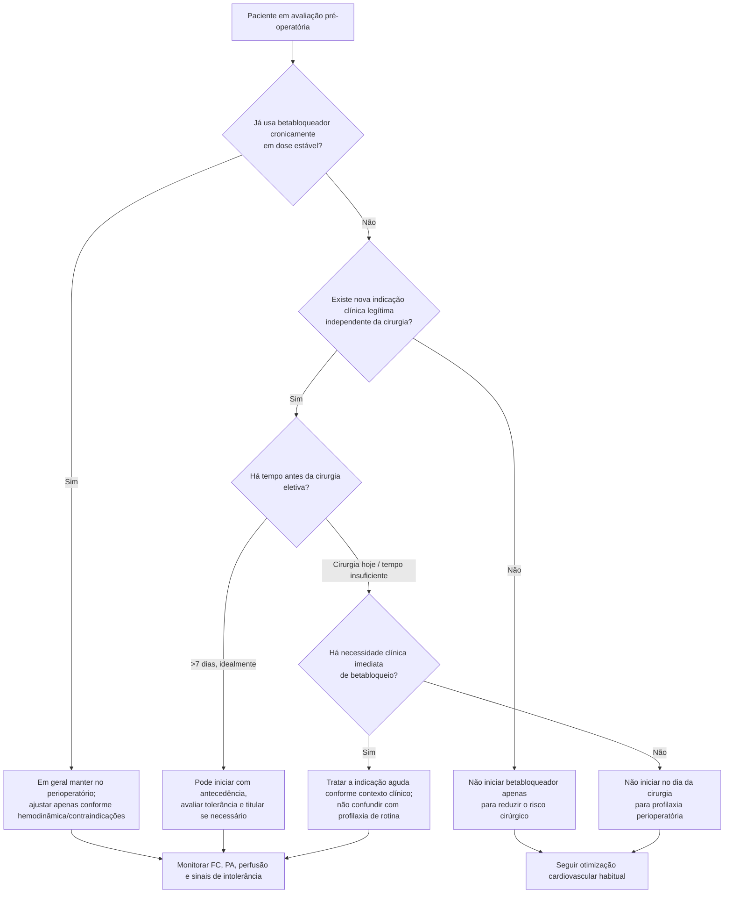

# POISE e betabloqueadores no perioperatório

O POISE mudou profundamente a interpretação dos betabloqueadores antes de cirurgia não cardíaca. O ensaio mostrou que reduzir eventos isquêmicos **não garante benefício clínico líquido** quando a estratégia aumenta hipotensão, AVC e mortalidade.

## Desenho

O POISE randomizou **8.351 pacientes** com doença aterosclerótica ou risco para aterosclerose submetidos a cirurgia não cardíaca para metoprolol de liberação prolongada ou placebo.

A estratégia do estudo iniciou betabloqueio **2–4 horas antes da cirurgia** e manteve tratamento por 30 dias. É esse início abrupto, em paciente previamente não tratado e com regime relativamente intenso, que precisa ser lembrado ao interpretar os resultados.

## Resultados centrais

Em comparação com placebo, metoprolol reduziu IAM:

- metoprolol: **176/4.174 (4,2%)**;
- placebo: **239/4.177 (5,7%)**;
- HR **0,73**.

Porém aumentou mortalidade total:

- metoprolol: **129 (3,1%)**;
- placebo: **97 (2,3%)**;
- HR **1,33**; IC95% **1,03–1,74**.

E aumentou AVC:

- metoprolol: **41 (1,0%)**;
- placebo: **19 (0,5%)**;
- HR **2,17**; IC95% **1,26–3,74**.

O ensinamento clínico não é que betabloqueadores sejam prejudiciais em qualquer contexto. O problema demonstrado foi uma estratégia de **iniciação perioperatória imediata em pacientes beta-bloqueador-naïve**, sem tempo adequado para verificar tolerabilidade e titular o tratamento.

## Como isso aparece na AHA/ACC 2024

A diretriz atual recomenda:

- paciente já em dose estável de betabloqueador: **manter no perioperatório** — Classe 1, B-NR;
- nova indicação legítima para betabloqueio em cirurgia eletiva: pode ser iniciado com antecedência suficiente para avaliar tolerância e titular, **idealmente >7 dias antes** — Classe 2b, B-NR;
- paciente sem necessidade imediata de betabloqueador: **não iniciar no dia da cirurgia** — Classe 3: Harm, B-R.

## Árvore de decisão

## Por que “reduziu IAM” não foi suficiente

O POISE ilustra um princípio essencial de medicina perioperatória: um tratamento pode reduzir um endpoint específico e ainda **piorar o desfecho líquido do paciente**.

Betabloqueio excessivo pode favorecer:

- hipotensão;
- bradicardia;
- hipoperfusão cerebral e de outros órgãos;
- incapacidade de responder ao estresse fisiológico perioperatório.

Esses mecanismos ajudam a entender por que uma queda de IAM coexistiu com aumento de AVC e morte.

## O que não extrapolar

- POISE não justifica suspender betabloqueador crônico de forma abrupta.
- POISE não elimina indicações clássicas de betabloqueadores para insuficiência cardíaca, DAC, arritmias ou outras condições.
- O estudo não prova que qualquer início pré-operatório seja danoso; a diretriz atual admite início quando existe indicação e há tempo adequado, idealmente >7 dias.

## Regra prática

**Betabloqueador não é “medicação de risco cirúrgico”. É tratamento de uma indicação clínica.** Continue quem já precisa; se surgir nova indicação, inicie com tempo para avaliar tolerância; não use o dia da cirurgia para criar profilaxia betabloqueadora de última hora.
