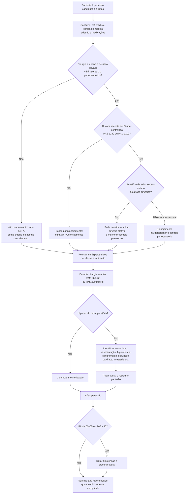

# Pressão arterial e cirurgia não cardíaca

A pressão arterial perioperatória tem dois erros simétricos:

1. **adiar cirurgia por uma medida isolada** sem considerar risco global, urgência e PA habitual;
2. concentrar-se apenas em hipertensão e negligenciar a **hipotensão intra e pós-operatória**, que se associa a lesão miocárdica, renal e outros desfechos adversos.

## Recomendações AHA/ACC 2024

### Pré-operatório

Na maioria dos pacientes hipertensos programados para cirurgia eletiva, é razoável continuar o tratamento anti-hipertensivo ao longo do perioperatório, individualizando fármacos que aumentem risco de hipotensão.

Em paciente que fará **cirurgia eletiva de risco elevado**, possui fatores de risco cardiovascular perioperatório e apresenta história recente de hipertensão mal controlada com:

- **PAS ≥180 mmHg**, ou
- **PAD ≥110 mmHg**

antes do dia da cirurgia, **adiar o procedimento pode ser considerado** para reduzir complicações — Classe 2b, C-LD.

Isso não equivale a cancelar automaticamente qualquer cirurgia quando a PA no consultório atinge esse valor.

### Intraoperatório

AHA/ACC recomenda manter:

- **PAM ≥60–65 mmHg**, ou
- **PAS ≥90 mmHg**

para reduzir risco de lesão miocárdica — Classe 1, B-NR.

### Pós-operatório

Hipotensão com:

- **PAM <60–65 mmHg**, ou
- **PAS <90 mmHg**

deve ser tratada para limitar eventos cardiovasculares, cerebrovasculares, renais e mortalidade — Classe 1, B-NR.

## Árvore de decisão

## Por que não existe um “número mágico” isolado para adiar

O risco depende de:

- cronicidade e controle habitual da PA;
- lesão de órgão-alvo;
- DAC, IC, AVC prévio e DRC;
- tipo/risco da cirurgia;
- possibilidade de sangramento e grandes variações hemodinâmicas;
- urgência do procedimento;
- risco de hipotensão causado pelo próprio tratamento.

A diretriz ressalta que não há ensaio robusto demonstrando que reduzir agudamente a PA antes da cirurgia melhore desfechos, e redução excessiva pode ser prejudicial.

## Medicações

A decisão de manter ou omitir um anti-hipertensivo depende da classe e da indicação. Exemplos já detalhados no módulo de medicações perioperatórias:

- betabloqueador crônico: em geral manter;
- bloqueador do SRAA usado apenas para HAS em cirurgia de risco elevado: omissão 24 h antes pode reduzir hipotensão em pacientes selecionados;
- bloqueador do SRAA como GDMT de ICFEr: continuação pode ser razoável conforme estado clínico.

## Regra prática

**A hipertensão pré-operatória deve ser interpretada no contexto; a hipotensão perioperatória deve ser ativamente evitada e tratada.** O objetivo não é normalizar um número a qualquer custo, mas preservar perfusão e reduzir risco ao longo de todo o período cirúrgico.
