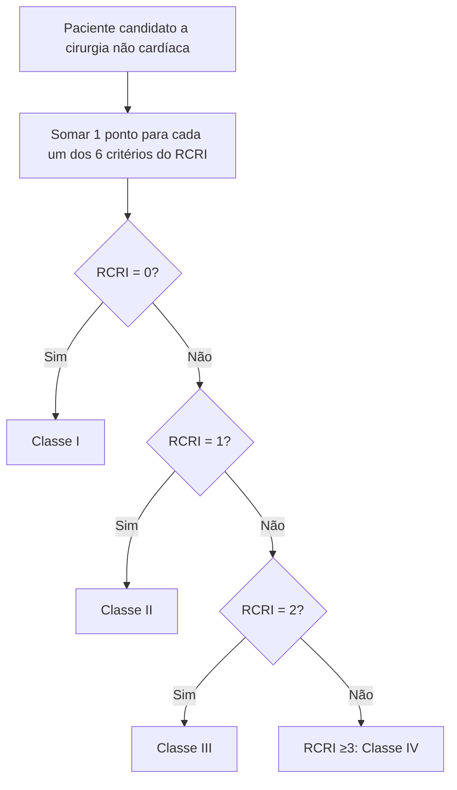
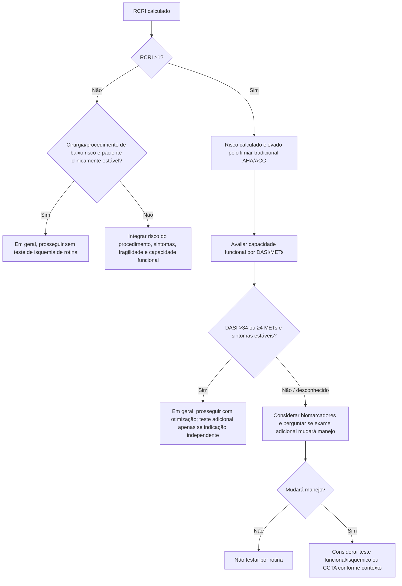

# RCRI — Revised Cardiac Risk Index

## O que o escore mede

O RCRI foi derivado para predizer complicações cardíacas maiores após cirurgia não cardíaca. São **6 variáveis binárias, 1 ponto cada**:

1. cirurgia de alto risco;
2. cardiopatia isquêmica;
3. insuficiência cardíaca;
4. doença cerebrovascular;
5. diabetes em uso de insulina;
6. creatinina sérica pré-operatória >2,0 mg/dL.

## Por que existem percentuais diferentes publicados para o mesmo RCRI

Não se deve apresentar um único percentual como se fosse universal. O **endpoint e a coorte** mudam a taxa observada.

Na coorte de validação original de Lee, para o composto clássico de IAM, edema pulmonar, fibrilação ventricular/parada cardíaca e bloqueio AV completo, as taxas observadas foram aproximadamente:

- 0 pontos: **0,4%**;
- 1 ponto: **0,9%**;
- 2 pontos: **7,0%**;
- ≥3 pontos: **11,0%**.

Quando o endpoint é redefinido para IAM, parada cardíaca e morte cardíaca, publicações de reavaliação do RCRI mostram estimativas menores na coorte original (aproximadamente 0,4%, 1,0%, 2,4% e 5,4%). Portanto, o laudo deve informar **qual endpoint está sendo citado**.

A diretriz AHA/ACC 2024 não exige converter cada classe em um percentual histórico específico para decidir investigação: tradicionalmente considera **RCRI >1** como um marcador de risco perioperatório elevado dentro do algoritmo clínico.

## Árvore de cálculo

## Árvore de uso clínico contemporâneo

## Vantagens

- Simples, reproduzível e amplamente validado.
- Útil para comunicação e para identificar pacientes em quem a avaliação deve ser aprofundada.
- Requer poucas variáveis e pode ser calculado à beira do leito.

## Limitações

- Não incorpora idade como variável contínua.
- Não incorpora capacidade funcional ou fragilidade.
- A definição de “cirurgia de alto risco” é histórica e não captura toda a granularidade dos procedimentos contemporâneos.
- O risco absoluto depende do endpoint e da população; não misturar taxas de diferentes recalibrações.
- RCRI alto **não é indicação automática de teste de estresse ou coronariografia**.
