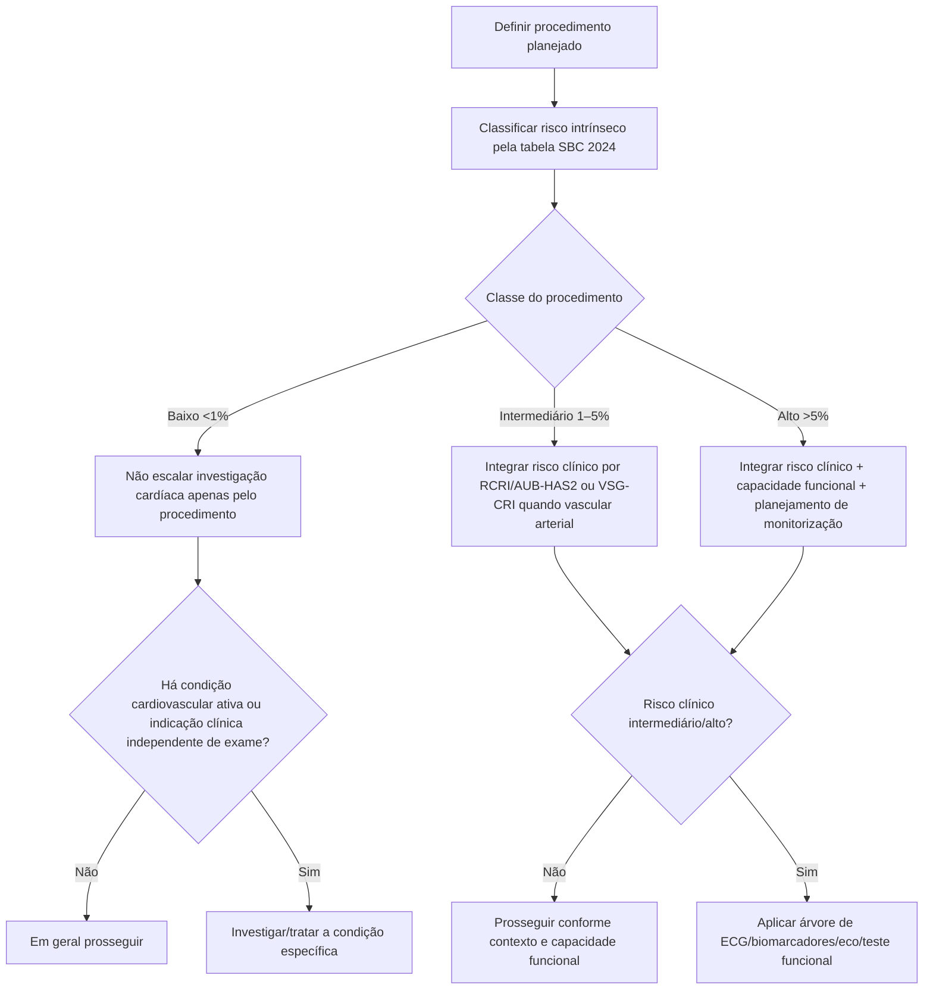

# Risco intrínseco do procedimento

O risco intrínseco da operação é determinado pelo tipo e duração do procedimento **sem considerar as características clínicas do paciente**. A SBC 2024 separa os procedimentos em três grupos de risco cardiovascular estimado.

## Classes

- **Baixo risco:** <1%.
- **Risco intermediário:** 1–5%.
- **Alto risco:** >5%.

## Árvore de utilização

## Exemplos da classificação SBC 2024

A Tabela 3 da diretriz inclui, entre outros exemplos:

### Baixo risco (<1%)

- cirurgia de mama;
- procedimentos dentários;
- cirurgia ocular;
- tireoide;
- ginecológica minor;
- ortopedia minor, como menisco.

### Risco intermediário (1–5%)

Inclui diversos procedimentos de maior porte, como exemplos presentes na tabela:

- cabeça e pescoço;
- cirurgia intraperitoneal como colecistectomia, hérnia hiatal e esplenectomia;
- aneurisma de aorta por técnica endovascular;
- procedimentos vasculares/carotídeos selecionados.

### Alto risco (>5%)

A tabela inclui procedimentos como:

- cirurgia de aorta/vascular major;
- revascularização periférica aberta por isquemia aguda ou amputação;
- procedimentos de grande porte específicos listados pela diretriz.

A classificação exata deve ser consultada para o procedimento concreto; não se deve inferir a categoria apenas pelo nome genérico da especialidade.

## Por que o risco cirúrgico não substitui o escore clínico

Um paciente clinicamente saudável pode realizar uma operação intrinsecamente de maior risco, enquanto um paciente com cardiopatia grave pode ter risco elevado mesmo diante de um procedimento simples. Por isso a avaliação usa **dois eixos independentes**:

1. risco do paciente;
2. risco do procedimento.

## Matriz visual

| Risco clínico | Cirurgia baixa | Cirurgia intermediária | Cirurgia alta |
|---|---|---|---|
| **Baixo** | geralmente prosseguir | avaliar contexto/capacidade | integrar capacidade e monitorização |
| **Intermediário** | individualizar | investigação dirigida quando indicada | vigilância e investigação seletiva |
| **Alto** | cardiopatia pode dominar o risco | estratégia multidisciplinar | estratégia intensificada e monitorização planejada |

## Regra prática

**Não classificar “risco cirúrgico” apenas pelo paciente nem apenas pela cirurgia.** A função Corvia deve apresentar ambos separadamente e depois mostrar a rota resultante na árvore de decisão.
