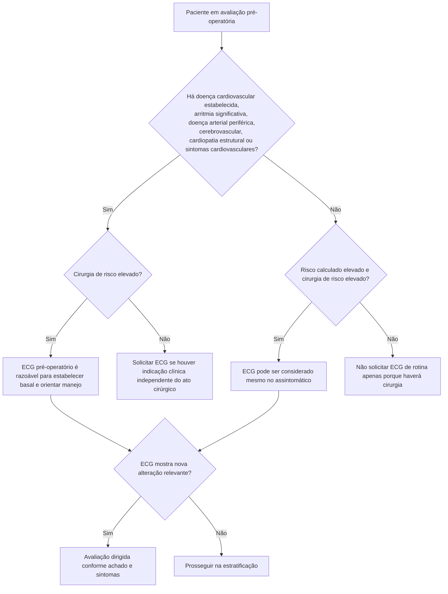
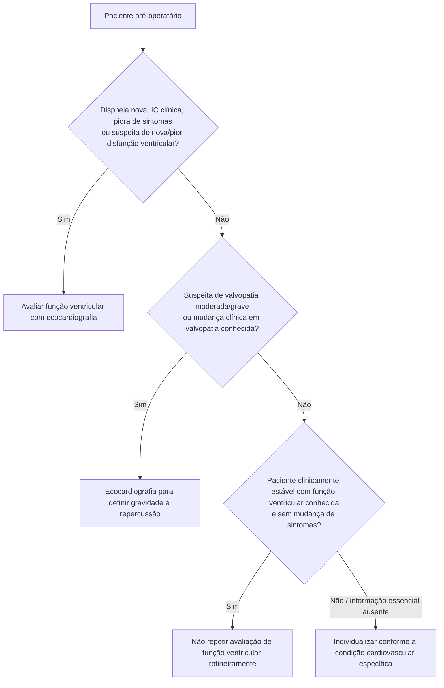
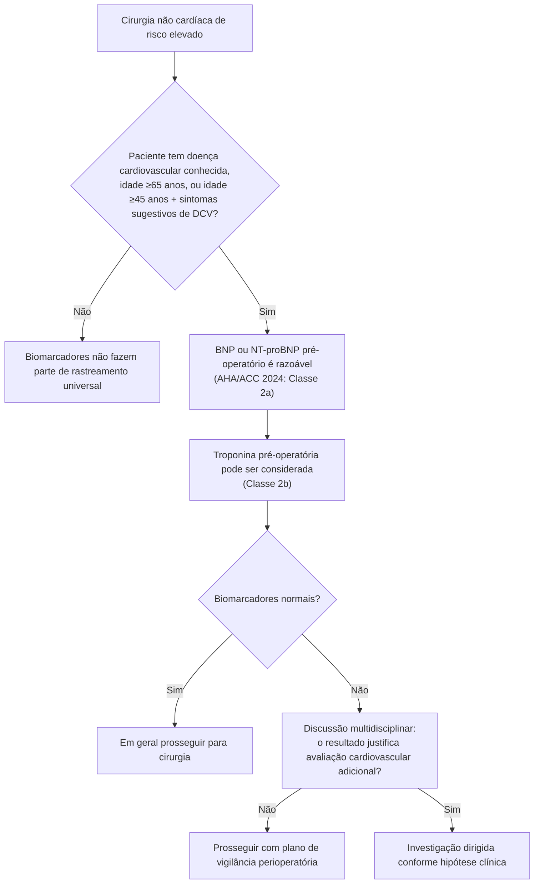
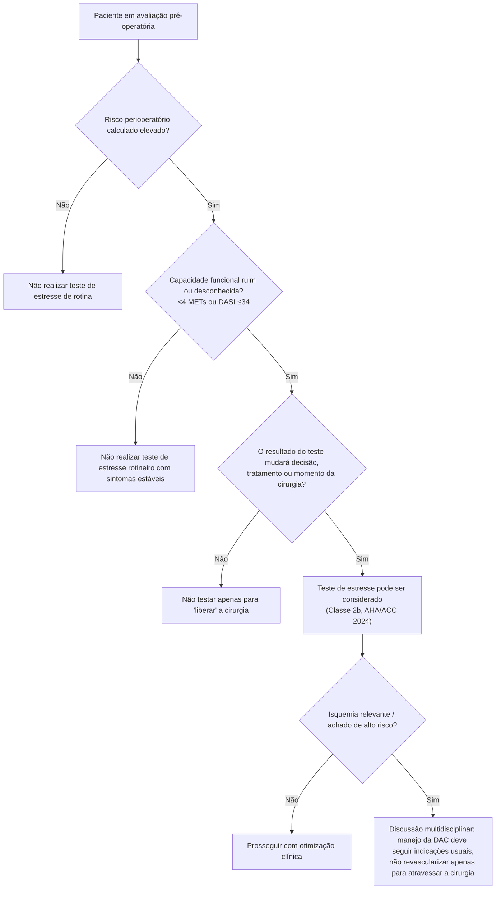
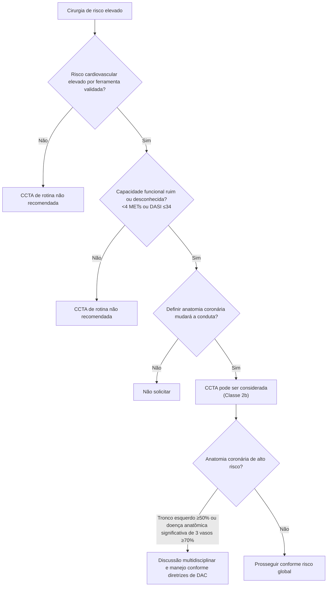

# Investigação cardiovascular pré-operatória

A investigação cardiovascular antes de cirurgia não cardíaca deve responder a uma pergunta clínica específica. A diretriz AHA/ACC 2024 recomenda evitar rastreamento indiscriminado e usar os mesmos princípios de indicação de exames empregados fora do contexto cirúrgico.

# 1. ECG de 12 derivações

# 2. Ecocardiograma / função ventricular

**Princípio:** ecocardiograma não é exame obrigatório para “risco cirúrgico”. Ele é indicado quando há suspeita clínica de disfunção ventricular ou doença valvar cuja definição possa alterar o manejo.

# 3. BNP/NT-proBNP e troponina pré-operatórios

Limiar usado na figura de decisão AHA/ACC 2024:

- troponina > percentil 99 do limite superior de referência do ensaio;
- **BNP >92 ng/L**;
- **NT-proBNP ≥300 ng/L**.

Esses valores são pontos de decisão da diretriz e não devem ser interpretados isoladamente como diagnóstico de insuficiência cardíaca ou síndrome coronariana.

# 4. Teste de estresse para isquemia

# 5. Angiotomografia coronária (CCTA)

# Resumo operacional

| Situação | Próximo passo |
|---|---|
| Baixo risco + cirurgia de baixo risco | Evitar testes cardíacos rotineiros |
| Doença/sintoma cardiovascular relevante | ECG e investigação dirigida conforme condição |
| Dispneia nova/IC piorando | Ecocardiografia |
| Suspeita de valvopatia moderada/grave | Ecocardiografia |
| Risco elevado + DASI ≤34/desconhecido | Perguntar se novo teste mudará manejo |
| Risco elevado + perfil clínico selecionado | BNP/NT-proBNP; troponina pode ser considerada |
| Risco elevado + baixa capacidade + resultado capaz de mudar conduta | Considerar estresse ou CCTA |

## Regra prática

A pergunta que antecede qualquer exame é: **“Se este resultado vier alterado, eu mudarei a estratégia?”** Se a resposta for não, o exame geralmente não deve ser solicitado apenas por causa da cirurgia.
