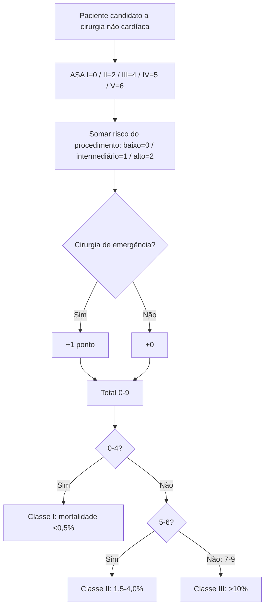
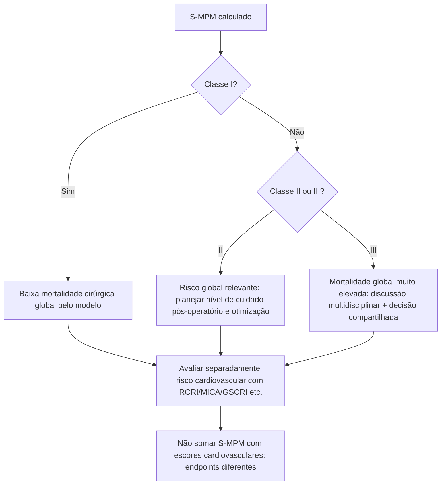

# S-MPM — Surgical Mortality Probability Model

## Endpoint

O S-MPM estima **mortalidade por todas as causas em 30 dias** após cirurgia não cardíaca. Portanto, ele complementa — mas não substitui — RCRI, Gupta MICA, AUB-HAS2, VSG-CRI ou GSCRI, cujos endpoints cardiovasculares são diferentes.

O estudo de derivação/validação utilizou **298.772 pacientes** do ACS-NSQIP de 2005–2007.

## Cálculo — 0 a 9 pontos

### ASA

- ASA I: 0;
- ASA II: 2;
- ASA III: 4;
- ASA IV: 5;
- ASA V: 6.

### Risco do procedimento no modelo S-MPM

- baixo: 0;
- intermediário: 1;
- alto: 2.

### Urgência

- não emergência: 0;
- emergência: +1.

## Classes

- **0–4 pontos — Classe I:** mortalidade <0,5%;
- **5–6 pontos — Classe II:** mortalidade 1,5–4,0%;
- **7–9 pontos — Classe III:** mortalidade >10%.

Na validação original, o modelo apresentou estatística C **0,897**.

## Árvore de cálculo

## Árvore de uso junto à avaliação cardiológica

## Armadilha importante

A **classe de risco cirúrgico usada pelo S-MPM foi empiricamente derivada** a partir de códigos de procedimentos. Ela não é necessariamente idêntica às categorias contemporâneas de risco cardiovascular ESC/AHA. O próprio estudo destaca que alguns procedimentos podem cair em categoria diferente da intuição clínica tradicional.

Quando o procedimento não puder ser classificado com segurança pela metodologia do S-MPM, registrar **VERIFICAÇÃO HUMANA NECESSÁRIA** em vez de atribuir uma classe arbitrária.

## Valor clínico

O S-MPM ajuda a responder uma pergunta diferente: “qual é o risco de morte cirúrgica global?”, útil para consentimento, alocação de recursos e nível de cuidado pós-operatório. Não deve ser apresentado ao paciente como “risco cardíaco”.
