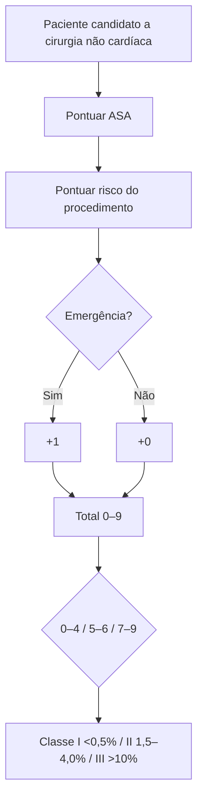
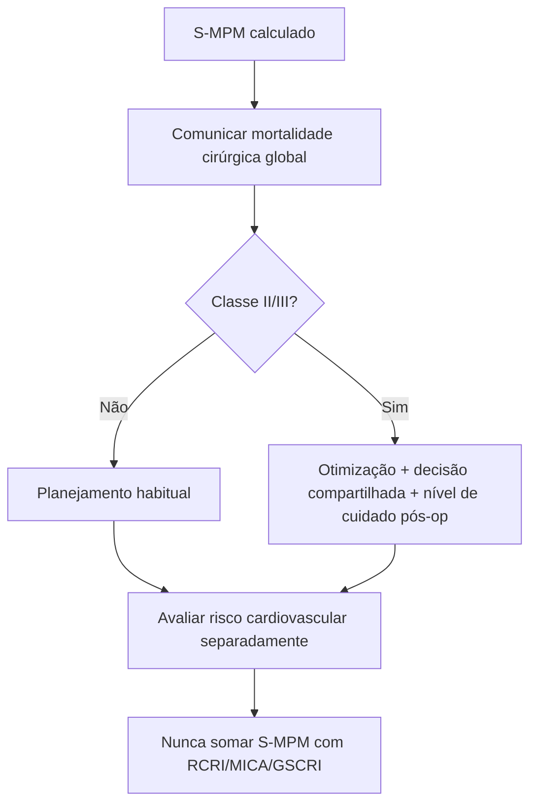

# S-MPM

Endpoint: **mortalidade por todas as causas em 30 dias**, não MICA/MACE.

Pontuação: ASA I/II/III/IV/V = 0/2/4/5/6; risco do procedimento baixo/intermediário/alto = 0/1/2; emergência = +1. Total 0–9.

Classes originais: 0–4 = Classe I, mortalidade <0,5%; 5–6 = Classe II, 1,5–4,0%; 7–9 = Classe III, >10%. C-stat de validação: **0,897**.

## Limitação crítica

A classe de risco do procedimento no S-MPM foi empiricamente derivada e não é automaticamente intercambiável com ESC/AHA. Se não puder ser enquadrada com segurança: **VERIFICAÇÃO HUMANA NECESSÁRIA**.