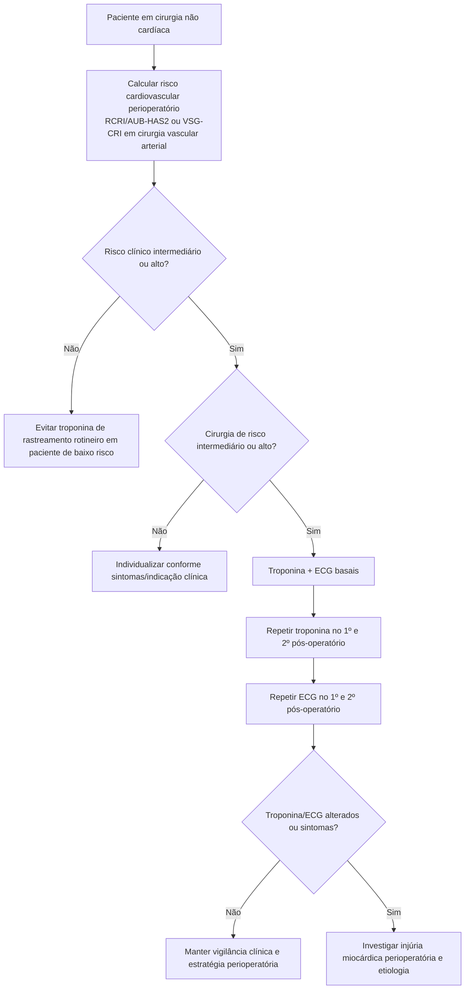
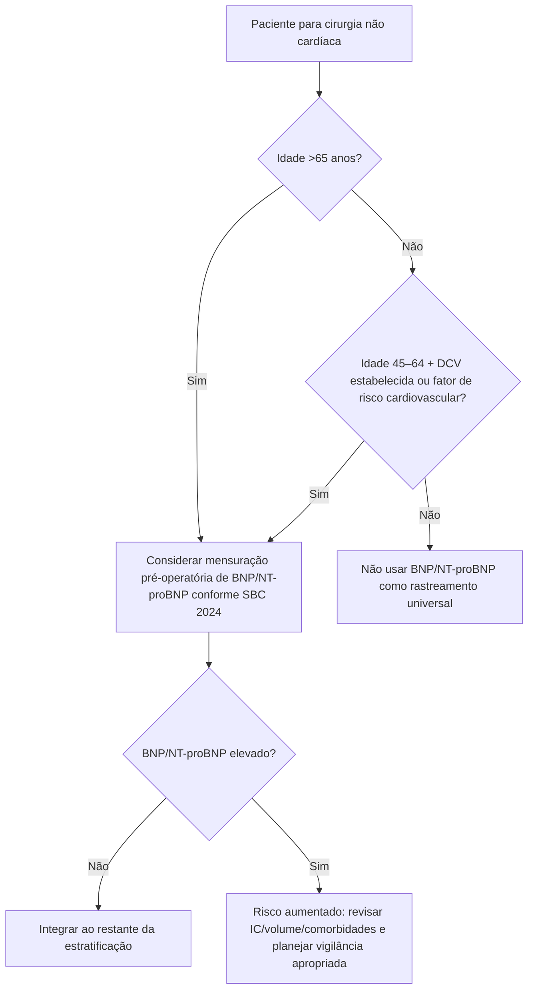
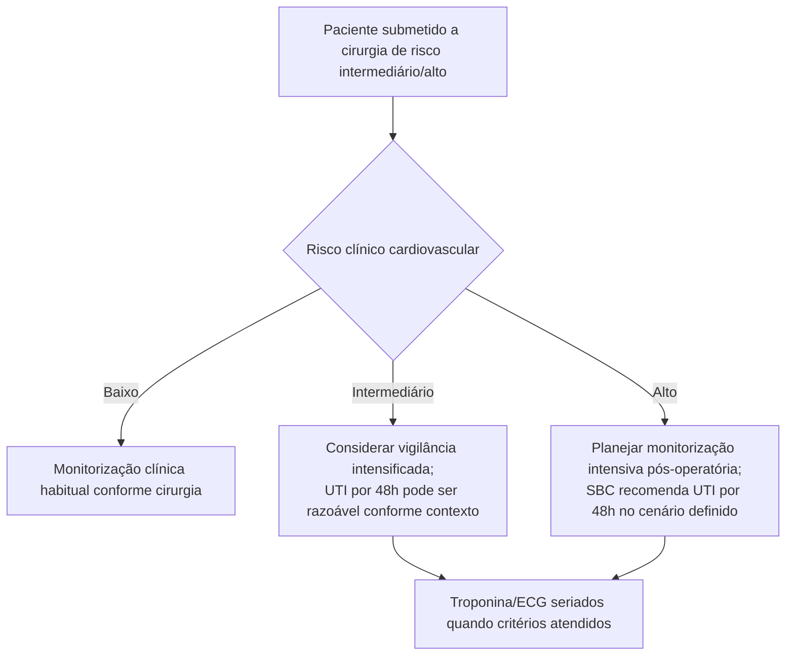

# Monitorização cardiovascular perioperatória segundo a SBC 2024

Uma diferença operacional importante da diretriz brasileira é a ênfase em **troponina e ECG seriados** para pacientes selecionados, permitindo reconhecer injúria miocárdica perioperatória mesmo quando analgesia, sedação ou apresentação atípica mascaram sintomas.

## Árvore: quem deve receber troponina + ECG seriados?

Na SBC 2024, troponina pré-operatória e no **1º e 2º dias pós-operatórios** em pacientes de risco clínico intermediário/alto submetidos a operações de risco intermediário/alto é recomendação **Classe I, nível B**. ECG pré-operatório e no 1º e 2º dias pós-operatórios nessa mesma população é **Classe I, nível C**.

## Injúria miocárdica perioperatória

A diretriz recomenda diagnosticar injúria miocárdica perioperatória pela variação absoluta da troponina em relação ao valor basal/pós-operatório, utilizando o **percentil 99 do limite superior de referência do ensaio** como referência operacional. A interpretação deve considerar o ensaio específico e o contexto clínico.

## Árvore: BNP/NT-proBNP pré-operatório

A diretriz brasileira cita evidência de maior risco perioperatório com valores pré-operatórios acima de aproximadamente:

- **BNP >92 pg/mL**;
- **NT-proBNP >300 pg/mL**.

Esses valores são marcadores prognósticos e **não constituem isoladamente diagnóstico de insuficiência cardíaca**.

## Árvore: nível de vigilância pós-operatória

A SBC 2024 apresenta recomendação de **48 horas de UTI** para pacientes de alto risco submetidos a cirurgia intermediária/alta (**Classe I C**) e considera a estratégia em pacientes de risco intermediário (**Classe IIa C**), de acordo com o contexto clínico e a disponibilidade assistencial.

## Regra prática

**O pós-operatório faz parte da estratificação.** Em pacientes de maior risco, não basta estimar o risco antes da cirurgia: a estratégia deve prever como detectar precocemente injúria miocárdica e deterioração cardiovascular depois do procedimento.
