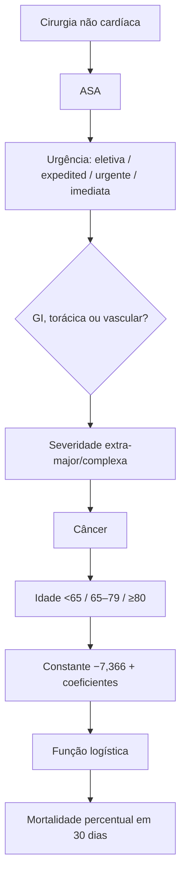
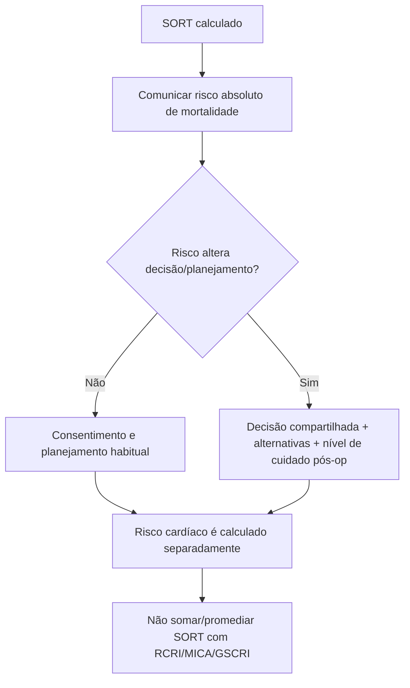

# SORT — Surgical Outcome Risk Tool

Endpoint: **mortalidade por todas as causas em 30 dias**. O modelo final teve **AUROC 0,91** na validação.

Constante **−7,366**. Coeficientes: ASA III +1,411; IV +2,388; V +4,081; urgência expedited +1,236; urgente +1,657; imediata +2,452; especialidade GI/torácica/vascular +0,712; cirurgia extra-major/complexa +0,381; câncer +0,667; idade 65–79 +0,777; ≥80 +1,591. Probabilidade = `exp(x)/[1+exp(x)]`.

Limitações: “extra-major/complexa” deve seguir a taxonomia original; expedited, urgente e imediata são categorias distintas. SORT não substitui avaliação cardiológica específica.