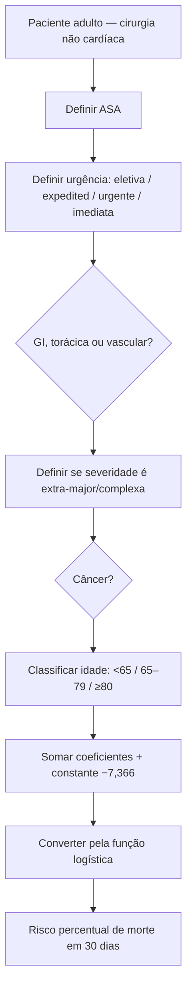
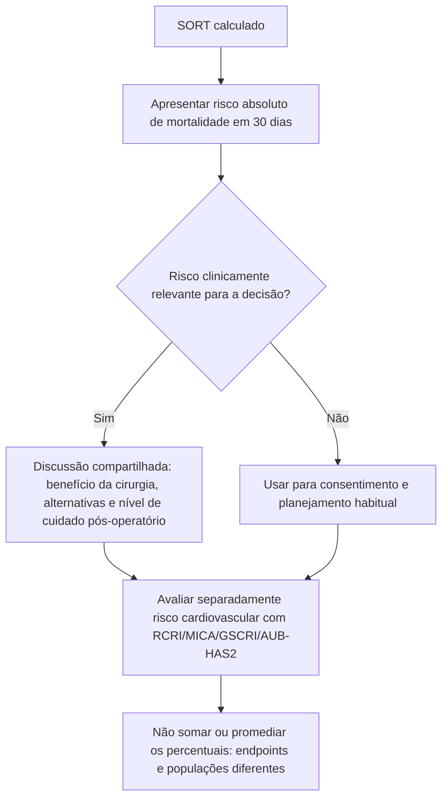

# SORT — Surgical Outcome Risk Tool

## Endpoint

O SORT estima **mortalidade por todas as causas em 30 dias** após cirurgia não cardíaca.

O estudo incluiu dados prospectivos de 19.097 casos em 326 hospitais. Após exclusões, 16.788 pacientes foram analisados: 11.219 na derivação e 5.569 na validação. O modelo final de seis variáveis apresentou **AUROC 0,91** na validação.

## Seis variáveis

1. classe ASA;
2. urgência cirúrgica;
3. especialidade de alto risco — gastrointestinal, torácica ou vascular;
4. severidade cirúrgica extra-major/complexa;
5. câncer;
6. idade.

## Coeficientes publicados

A regressão logística final utiliza constante **−7,366**.

- ASA III: +1,411;
- ASA IV: +2,388;
- ASA V: +4,081;
- urgência expedited: +1,236;
- urgente: +1,657;
- imediata: +2,452;
- especialidade de alto risco: +0,712;
- cirurgia extra-major/complexa: +0,381;
- câncer: +0,667;
- idade 65–79: +0,777;
- idade ≥80: +1,591.

ASA I/II, cirurgia eletiva, especialidade não classificada como alto risco, procedimento abaixo de extra-major/complexo, ausência de câncer e idade <65 constituem as respectivas referências.

`p = exp(x) / [1 + exp(x)]`

## Árvore de cálculo

## Árvore de interpretação

## Diferença entre SORT e S-MPM

Ambos predizem mortalidade global, porém:

- **S-MPM** é um escore aditivo simples de 9 pontos com três componentes;
- **SORT** é regressão logística e fornece risco percentual individual contínuo;
- o SORT incorpora idade, câncer, urgência, ASA, especialidade e complexidade.

## Limitações

- A definição de **extra-major/complexa** deve seguir a taxonomia de severidade usada pelo SORT.
- “Expedited”, “urgente” e “imediata” não são sinônimos; classificação incorreta altera o risco.
- Não utilizar o SORT como substituto de avaliação cardiológica específica quando houver sintomas, cardiopatia ativa ou fatores cardiovasculares relevantes.