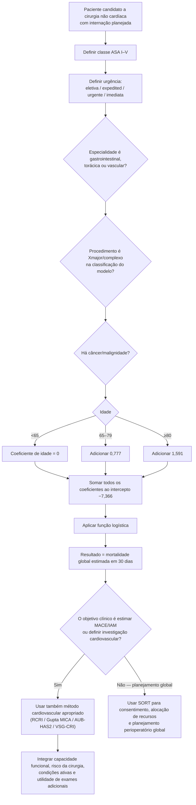

# SORT v1 — Surgical Outcome Risk Tool original (2014)

O **SORT v1** foi desenvolvido para estimar **mortalidade por qualquer causa em 30 dias** após cirurgia não cardíaca. Ele não é um escore de MACE, infarto ou parada cardíaca e, portanto, seu percentual **não deve ser comparado diretamente** com RCRI ou Gupta MICA como se os desfechos fossem equivalentes.

A coorte original analisou **16.788 pacientes**: 11.219 na derivação e 5.569 na validação. Na validação interna, o SORT apresentou AUROC **0,91 (IC95% 0,88–0,94)** para mortalidade em 30 dias.

## Variáveis e coeficientes

O preditor linear é iniciado pela constante **−7,366** e recebe os coeficientes abaixo quando a condição está presente:

| Variável | Coeficiente |
|---|---:|
| ASA III | +1,411 |
| ASA IV | +2,388 |
| ASA V | +4,081 |
| Cirurgia expedited | +1,236 |
| Cirurgia urgente | +1,657 |
| Cirurgia imediata | +2,452 |
| Especialidade de alto risco: gastrointestinal, torácica ou vascular | +0,712 |
| Gravidade cirúrgica Xmajor/complexa | +0,381 |
| Câncer/malignidade | +0,667 |
| Idade 65–79 anos | +0,777 |
| Idade ≥80 anos | +1,591 |

ASA I–II, cirurgia eletiva, idade <65 anos e ausência das demais características acrescentam zero ao preditor linear.

A probabilidade é calculada por regressão logística:

**P(morte em 30 dias) = e^x / (1 + e^x)**

em que **x = −7,366 + soma dos coeficientes presentes**.

## Árvore de decisão da metodologia

## Como interpretar corretamente

O SORT responde a uma pergunta diferente dos escores cardíacos:

- **SORT v1:** qual é o risco de **morte por qualquer causa em 30 dias**?
- **Gupta MICA:** qual é o risco de **IAM ou parada cardíaca** perioperatória?
- **RCRI:** qual é a classe de risco para o composto cardíaco definido na coorte de Lee?
- **AUB-HAS2:** qual é o risco para o composto de **morte, IAM ou AVC**?
- **VSG-CRI:** qual é o risco de complicação cardíaca no contexto específico de cirurgia vascular arterial?

Por isso, não se deve somar, promediar ou escolher automaticamente o maior percentual.

## População do estudo original

A análise incluiu pacientes com cirurgia que exigia internação. Foram excluídos procedimentos ambulatoriais/day-case, obstétricos, neurocirúrgicos, cirurgia cardíaca e transplante. A aplicação fora desse domínio exige cautela.

## Validação externa

Uma validação multicêntrica sueca posterior incluiu 17.965 pacientes e encontrou AUROC **0,91 (IC95% 0,89–0,92)**, com boa calibração global, reforçando a transportabilidade do modelo original em outra população europeia.

## Limitações

- Esta implementação corresponde ao **SORT original publicado em 2014 (v1)**. Não deve ser apresentada como equivalente a versões posteriores do calculador SORT.
- A definição de **Xmajor/complexa** e da urgência cirúrgica deve seguir a classificação operacional adequada; erro de classificação altera o risco calculado.
- O modelo prediz mortalidade global, não identifica a causa do risco e não define, isoladamente, indicação de ECG, ecocardiograma, biomarcadores ou teste de isquemia.
- O resultado deve complementar, e não substituir, avaliação clínica, fragilidade, capacidade funcional e discussão anestésico-cirúrgica.

## Regra prática

**Use o SORT para quantificar mortalidade global; use os escores cardiovasculares e as árvores de investigação para decidir o componente cardíaco do risco.**
