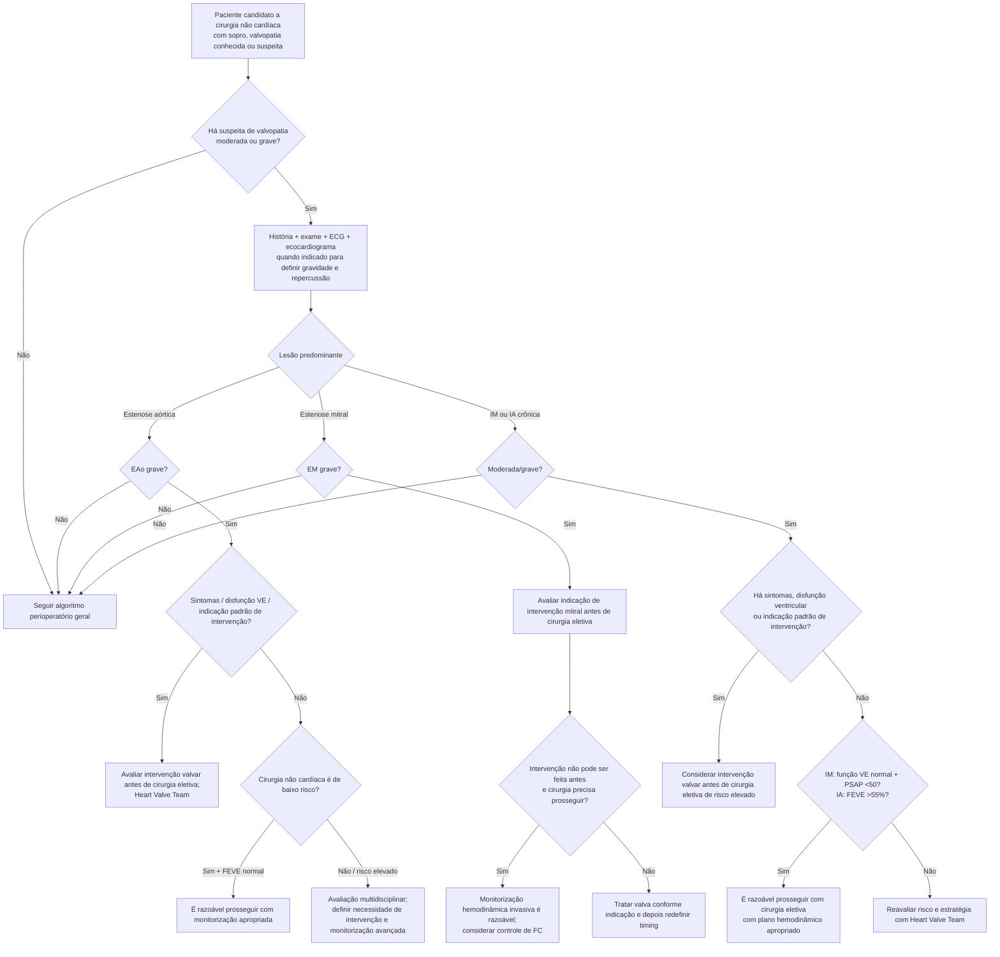

# Valvopatia e cirurgia não cardíaca

A presença de valvopatia importante não é adequadamente resumida por RCRI ou Gupta MICA. O risco depende de **tipo da lesão, gravidade, sintomas, resposta ventricular, pressão pulmonar e risco hemodinâmico do procedimento**.

A primeira regra é simples: se há suspeita de lesão moderada ou grave e a informação ecocardiográfica é necessária para orientar o procedimento, **defina a anatomia e a hemodinâmica antes da cirurgia eletiva**.

## Árvore geral

# Estenose aórtica

A AHA/ACC 2024 recomenda que pacientes com **EAo grave** sejam avaliados quanto à necessidade de intervenção aórtica antes de cirurgia não cardíaca eletiva.

A diretriz utiliza como critérios ecocardiográficos de EAo grave:

- área valvar aórtica **<1,0 cm²**; ou
- gradiente médio **≥40 mmHg**; ou
- velocidade máxima transvalvar **Vmax ≥4,0 m/s**.

Em paciente com suspeita de EAo moderada ou grave que fará cirurgia não cardíaca de risco elevado, ecocardiograma pré-operatório é recomendado para guiar manejo.

Paciente assintomático com EAo moderada/grave, função sistólica de VE normal e ecocardiograma recente pode realizar cirurgia eletiva de **baixo risco** de forma razoável, com monitorização adequada.

## Por que EAo sintomática muda tanto o risco

Na estenose fixa importante, hipotensão, taquicardia, perda de pré-carga ou grandes variações de volume podem reduzir abruptamente débito cardíaco e perfusão coronária.

O planejamento deve minimizar:

- hipotensão;
- taquicardia;
- hipertensão excessiva;
- desidratação;
- sobrecarga volêmica.

# Estenose mitral

Pacientes com **EM grave** devem ser avaliados quanto à necessidade de intervenção mitral antes de cirurgia eletiva.

Quando a intervenção não pode ser realizada e a cirurgia precisa prosseguir:

- monitorização hemodinâmica invasiva é razoável — Classe 2a;
- controle perioperatório de frequência cardíaca pode ser considerado — Classe 2b — para prolongar tempo diastólico e limitar elevação de pressão atrial/pulmonar.

A fisiologia exige atenção particular a:

- taquicardia;
- fibrilação atrial;
- hipoxemia/hipercapnia que aumentem pressão pulmonar;
- excesso de volume e edema pulmonar.

# Insuficiência mitral e insuficiência aórtica

Em suspeita de regurgitação valvar moderada ou grave, ecocardiograma pré-operatório é recomendado antes de cirurgia eletiva para definir severidade e repercussão.

Se o paciente já cumpre indicação padrão de intervenção valvar, a necessidade de tratar a valva deve ser considerada antes de cirurgia não cardíaca de risco elevado.

A AHA/ACC 2024 considera razoável prosseguir com cirurgia eletiva em:

- **IM moderada/grave assintomática**, função sistólica de VE normal e **PSAP <50 mmHg**;
- **IA moderada/grave assintomática** e função sistólica de VE normal, definida na recomendação como **FEVE >55%**.

## Diferenças hemodinâmicas importam

Lesões regurgitantes geralmente toleram melhor redução moderada de pós-carga que lesões estenóticas, mas isso não elimina risco.

- Na IM, evitar aumento excessivo de pós-carga e bradicardia importante; manter pré-carga adequada.
- Na IA importante, bradicardia prolonga diástole e pode aumentar volume regurgitante; volume e pressão precisam ser cuidadosamente manejados.

## Regra prática

**“Valvopatia grave” não é um diagnóstico único.** A árvore precisa separar estenose de regurgitação, sintomas de assintomáticos e baixo risco de cirurgia de procedimentos com grandes variações hemodinâmicas. O ecocardiograma serve para planejar manejo — não para criar atraso automático sem pergunta clínica definida.
