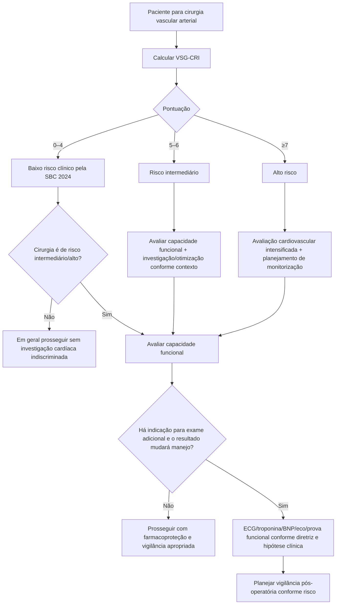

# VSG-CRI

O VSG-CRI foi desenvolvido especificamente para pacientes submetidos a cirurgia vascular, pois o RCRI subestimava complicações cardíacas em vários procedimentos vasculares na coorte do Vascular Study Group of New England.

Na coorte original, o desfecho cardíaco composto incluiu **infarto do miocárdio, arritmia clinicamente relevante ou insuficiência cardíaca congestiva durante a internação**.

## Pontuação

| Fator | Pontos |
|---|---:|
| Idade ≥80 anos | +4 |
| Idade 70–79 anos | +3 |
| Idade 60–69 anos | +2 |
| Doença arterial coronariana | +2 |
| Insuficiência cardíaca | +2 |
| DPOC | +2 |
| Creatinina >1,8 mg/dL | +2 |
| Tabagismo atual ou prévio conforme variável do modelo | +1 |
| Diabetes em uso de insulina | +1 |
| Uso crônico de betabloqueador | +1 |
| Revascularização miocárdica prévia (CABG/PCI) | −1 |

## Classes utilizadas pela SBC 2024

- **0–4:** baixo risco;
- **5–6:** risco intermediário;
- **≥7:** alto risco.

A tabela original também descreveu seis estratos de pontuação, com taxas de complicação cardíaca aumentando de aproximadamente **2,6% em 0–3 pontos** até **14,3% em ≥8 pontos**. Essas taxas refletem a coorte original e não devem ser interpretadas como probabilidade individual contemporânea exata.

## Árvore de decisão

## Por que o escore é diferente do RCRI

O VSG-CRI incorpora idade em faixas, DPOC, tabagismo e tratamento crônico com betabloqueador, além de reconhecer revascularização coronária prévia como fator protetor no modelo. Ele foi derivado especificamente em procedimentos vasculares não emergenciais.

## Limitações

- Não foi desenvolvido para cirurgias não vasculares.
- Taxas absolutas de evento pertencem à coorte de derivação/validação original.
- Estudos posteriores mostraram desempenho variável em diferentes populações vasculares.
- O uso crônico de betabloqueador é uma **variável prognóstica do modelo** e não deve ser interpretado como evidência de que betabloqueadores causam aumento de risco.
- **VERIFICAÇÃO HUMANA NECESSÁRIA**: dos seis estratos de pontuação da tabela original, só os dois extremos (2,6% em 0–3 pontos e 14,3% em ≥8 pontos) estão confirmados diretamente no abstract do Bertges 2010. Os quatro valores intermediários usados na calculadora da Corvia (3,5%/6,0%/6,6%/8,9% para 4/5/6/7 pontos) vieram de fonte secundária e não foram conferidos contra a tabela do texto completo (paywall, sem PMC) — achado ao revisar este conteúdo em 07/08/2026.

## Regra prática

Para **cirurgia vascular arterial**, a SBC 2024 direciona a estratificação clínica preferencialmente ao VSG-CRI. O escore deve ser integrado à urgência, risco intrínseco do procedimento, capacidade funcional e condições cardiovasculares ativas.
