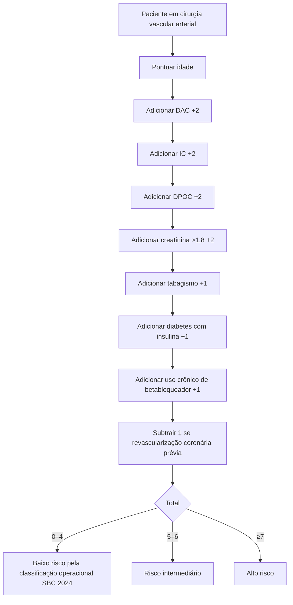
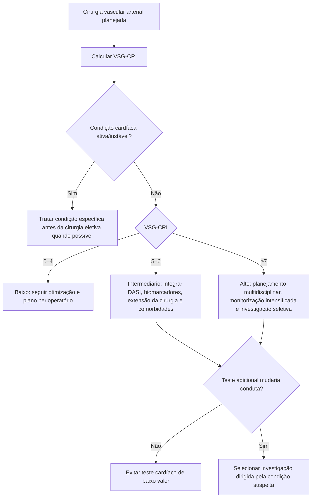

# VSG-CRI — índice específico para cirurgia vascular

## Por que existe um escore específico

O Revised Cardiac Risk Index (RCRI) pode **subestimar complicações cardíacas em cirurgia vascular**. O Vascular Study Group of New England Cardiac Risk Index (VSG-CRI) foi derivado em pacientes submetidos a procedimentos vasculares e demonstrou desempenho superior ao RCRI nesse cenário.

A coorte original incluiu **10.081 pacientes** submetidos a:

- endarterectomia de carótida;
- bypass de membro inferior;
- EVAR;
- reparo aberto de aneurisma de aorta abdominal infrarrenal.

## Variáveis do VSG-CRI

A implementação atual da Corvia utiliza a pontuação descrita no estudo e reproduzida na Diretriz SBC 2024:

- idade 60–69: **2 pontos**;
- idade 70–79: **3 pontos**;
- idade ≥80: **4 pontos**;
- doença arterial coronariana: **2**;
- insuficiência cardíaca: **2**;
- DPOC: **2**;
- creatinina >1,8 mg/dL: **2**;
- tabagismo: **1**;
- diabetes em uso de insulina: **1**;
- uso crônico de betabloqueador: **1**;
- revascularização coronária prévia: **−1**.

> O uso de betabloqueador aparece como variável prognóstica do modelo; **não deve ser interpretado causalmente como “betabloqueador aumenta risco”** e não constitui motivo para suspensão perioperatória por conta do escore.

## Árvore de cálculo

## Evidência original

Na derivação, as taxas de complicações cardíacas cresceram conforme a carga de fatores do modelo. O artigo descreve seis categorias de risco, com extremos variando de aproximadamente **2,6%** (escore 0–3) até **14,3%** (escore 8).

Os valores intermediários exatos da tabela original não foram todos confirmados diretamente nesta revisão porque o texto/tabela completa do artigo não estava integralmente acessível em fonte primária aberta.

**VERIFICAÇÃO HUMANA NECESSÁRIA** para percentuais intermediários antes de exibi-los como taxas históricas verificadas.

A calculadora da Corvia já mantém essa distinção: extremos confirmados são identificados como tal e valores intermediários não devem ser apresentados como igualmente auditados.

## Árvore de uso clínico

## Por que não usar VSG-CRI em toda cirurgia

Ele foi criado para **cirurgia vascular arterial**, população na qual o risco aterosclerótico e cardíaco é particularmente alto. Não há justificativa para substituir RCRI/Gupta/AUB-HAS2 por VSG-CRI em, por exemplo, colecistectomia ou cirurgia ortopédica eletiva.

## Comparação com RCRI na coorte original

O estudo concluiu que o RCRI subestimava eventos hospitalares, especialmente após:

- bypass de membro inferior;
- EVAR;
- reparo aberto de aneurisma abdominal.

Isso é um exemplo de por que o tipo de cirurgia deve influenciar a escolha do modelo de risco.

## Armadilhas

1. Não extrapolar VSG-CRI para cirurgia não vascular.
2. Não suspender betabloqueador porque ele pontua no modelo.
3. Não interpretar revascularização coronária prévia como fator protetor causal; ela é uma variável observacional do escore.
4. Não usar percentuais históricos como probabilidade individual contemporânea sem calibração.
5. Não pedir teste isquêmico automaticamente porque o VSG-CRI é alto.

## Fontes verificadas

1. Bertges DJ, Goodney PP, Zhao Y, et al. The Vascular Study Group of New England Cardiac Risk Index (VSG-CRI) predicts cardiac complications more accurately than the Revised Cardiac Risk Index in vascular surgery patients. *J Vasc Surg.* 2010;52(3):674-683.e3. PMID **20570467**. DOI **10.1016/j.jvs.2010.03.031**.
2. Gualandro DM, Fornari LS, Caramelli B, et al. Diretriz de Avaliação Cardiovascular Perioperatória da Sociedade Brasileira de Cardiologia – 2024. *Arq Bras Cardiol.* 2024;121(9):e20240590. PMID **39442131**. PMCID **PMC12094288**. DOI **10.36660/abc.20240590**.

## Status de revisão

`VERIFICAÇÃO HUMANA NECESSÁRIA`: os percentuais intermediários de risco por pontuação devem ser conferidos contra a tabela primária antes de publicação como valores numéricos definitivos.
