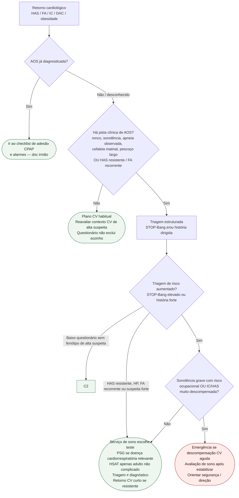

# Fluxograma ambulatorial: AOS — rastreio e destino

Prosa: [`sinalizadores-ambulatoriais-de-aos-quando-rastrear-e-encaminhar`](/biblioteca/sinalizadores-ambulatoriais-de-aos-quando-rastrear-e-encaminhar). AOS conhecida: [`checklist-ambulatorial-aos-conhecida-adesao-cpap-e-alarmes`](/biblioteca/checklist-ambulatorial-aos-conhecida-adesao-cpap-e-alarmes). Perioperatório: [`aplicacao-do-stop-bang-na-triagem-de-apneia-obstrutiva-do-sono-pre-operatoria-em-cirurgia-cardiaca`](/biblioteca/aplicacao-do-stop-bang-na-triagem-de-apneia-obstrutiva-do-sono-pre-operatoria-em-cirurgia-cardiaca).

## Árvore de decisão

## Notas

- **D0**: bifurca diagnóstico prévio vs primeira suspeita.
- **D1**: filtro de probabilidade — alinhado a AHA 2021 e ao papel da AOS na HAS (ESC 2024).
- **D2**: STOP-Bang é **triagem** (PMID 18431116), não fecha AOS.
- **D3/C3**: prioriza segurança e descompensação; não inventa meta de eventos do SAVE.
- Não decide pressão de CPAP, tipo de máscara nem suspender GDMT.

## Integração com o hub e limites

Usar o [hub apneia do sono e coração](/doencas/apneia-do-sono-e-coracao) para a sequência diagnóstica longitudinal; este documento organiza somente destino/adesão, sem algoritmo concorrente. STOP-Bang é triagem, nunca diagnóstico nem exclusão isolada em HAS resistente, HP ou FA recorrente. AHA 2021 recomenda atenção a esses fenótipos mesmo sem ronco/sonolência. HSAT serve a adultos não complicados de alta probabilidade; PSG é preferível em doença cardiorrespiratória significativa, suspeita central/hipoventilação, neuromuscular, opioides, insônia grave ou HSAT negativo/inconclusivo com suspeita. AOS e apneia central não usam estratégias ventilatórias intercambiáveis.

SAVE não demonstrou redução significativa do composto CV primário na população/adesão estudadas; isso não nega benefícios sintomáticos de CPAP. Avaliar máscara, fuga, AHI residual, dados de uso e barreiras sem meta universal de horas/noite. Tratar AOS e HAS/FA/IC em paralelo. Sonolência ao dirigir exige segurança imediata e avaliação urgente conforme regras locais; não inventar prazo legal.
