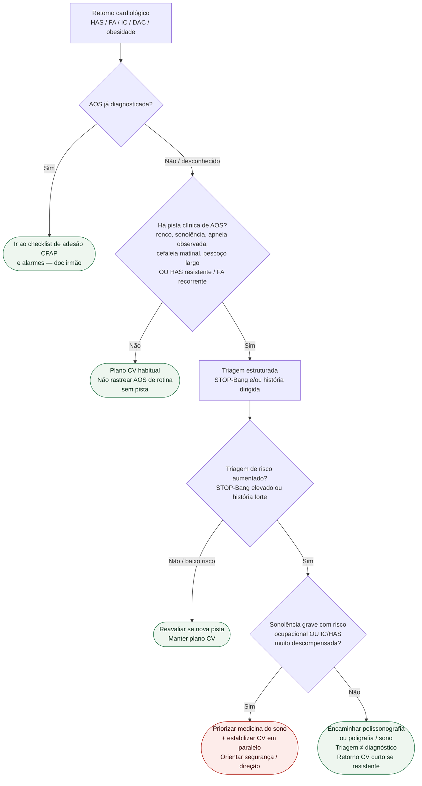

# Fluxograma ambulatorial: AOS — rastreio e destino

Prosa: [`sinalizadores-ambulatoriais-de-aos-quando-rastrear-e-encaminhar`](sinalizadores-ambulatoriais-de-aos-quando-rastrear-e-encaminhar.md). AOS conhecida: [`checklist-ambulatorial-aos-conhecida-adesao-cpap-e-alarmes`](checklist-ambulatorial-aos-conhecida-adesao-cpap-e-alarmes.md). Perioperatório: [`aplicacao-do-stop-bang-na-triagem-de-apneia-obstrutiva-do-sono-pre-operatoria-em-cirurgia-cardiaca`](../Cardiologia_do_Esporte_e_do_Exercício/aplicacao-do-stop-bang-na-triagem-de-apneia-obstrutiva-do-sono-pre-operatoria-em-cirurgia-cardiaca.md).

## Árvore de decisão

## Notas

- **D0**: bifurca diagnóstico prévio vs primeira suspeita.
- **D1**: filtro de probabilidade — alinhado a AHA 2021 e ao papel da AOS na HAS (ESC 2024).
- **D2**: STOP-Bang é **triagem** (PMID 18431116), não fecha AOS.
- **D3/C3**: prioriza segurança e descompensação; não inventa meta de eventos do SAVE.
- Não decide pressão de CPAP, tipo de máscara nem suspender GDMT.
