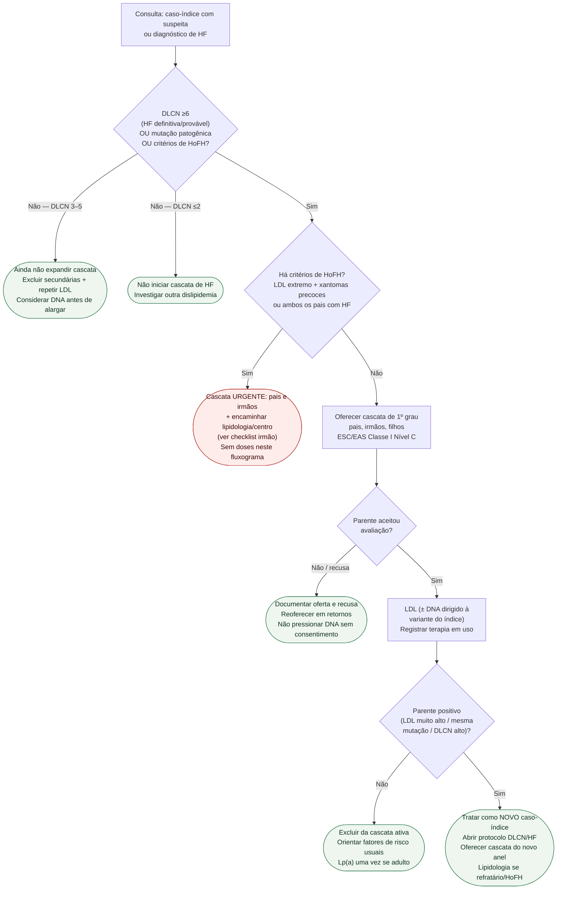

# Fluxograma ambulatorial: cascata HF — destino e lipidologia

Prosa: [`sinalizadores-ambulatoriais-rastreio-familiar-cascata-hf-quando-iniciar`](sinalizadores-ambulatoriais-rastreio-familiar-cascata-hf-quando-iniciar.md). Encaminhar lipidologia: [`checklist-ambulatorial-encaminhar-clinica-de-lipidios-ldl-refratario-hofh`](checklist-ambulatorial-encaminhar-clinica-de-lipidios-ldl-refratario-hofh.md). Diagnóstico DLCN: [`fluxograma-hipercolesterolemia-familiar-diagnostico-dlcn-e-manejo-esc-eas-2025`](fluxograma-hipercolesterolemia-familiar-diagnostico-dlcn-e-manejo-esc-eas-2025.md).

## Árvore de decisão

## Notas

- **D1**: gate — só cascata de HF com probabilidade clínica suficiente (Nordestgaard/ESC).
- **D2/C3**: HoFH não espera o mesmo prazo da HeFH estável (Cuchel 2023).
- **D3**: oferta documentada > “fale com sua família” sem registro.
- **D4/C6**: cada positivo reinicia o anel — essência da cascata.
- Não decide doses, aférese nem esquema de iPCSK9.
