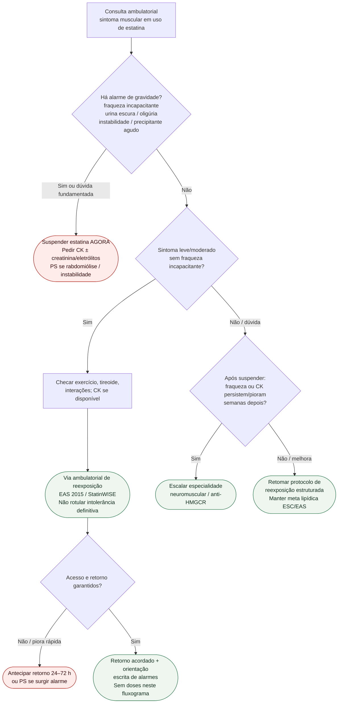

# Fluxograma ambulatorial: SAMS — destino

Prosa: [`sinalizadores-ambulatoriais-sams-quando-suspender-e-escalar-labs`](sinalizadores-ambulatoriais-sams-quando-suspender-e-escalar-labs.md).

## Árvore de decisão

## Notas

- **D1** = gate de segurança (suspender + labs / PS).
- **D2** = SAMS comum → reexposição (StatinWISE / EAS).
- **D3** = não-resolução → especialidade (anti-HMGCR).
- Não decide doses nem o próximo hipolipemiante não estatínico.
