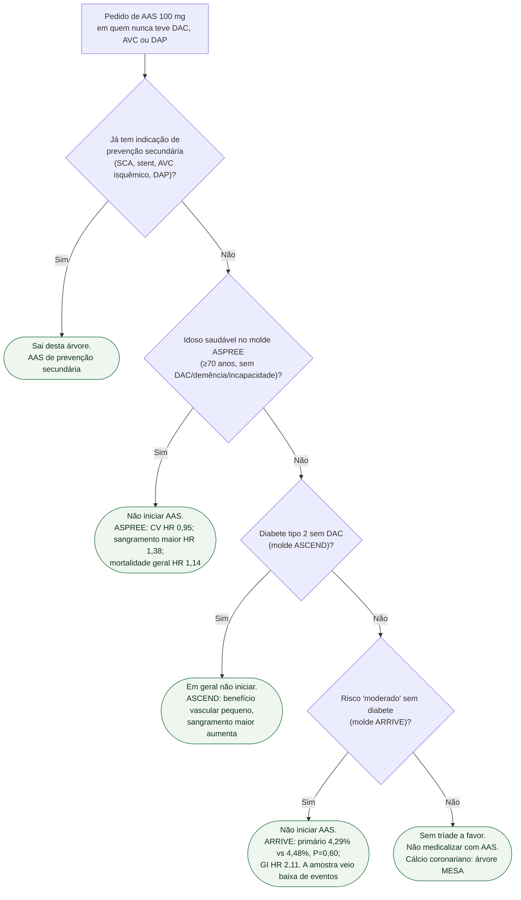

# Fluxograma: aspirina em prevenção primária — ASCEND, ASPREE, ARRIVE

## Mensagem prática

**Prevenção primária: a tríade ARRIVE / ASPREE / ASCEND não autoriza AAS rotineira.** Sangra mais do que previne. Cálcio coronariano é outro documento.
