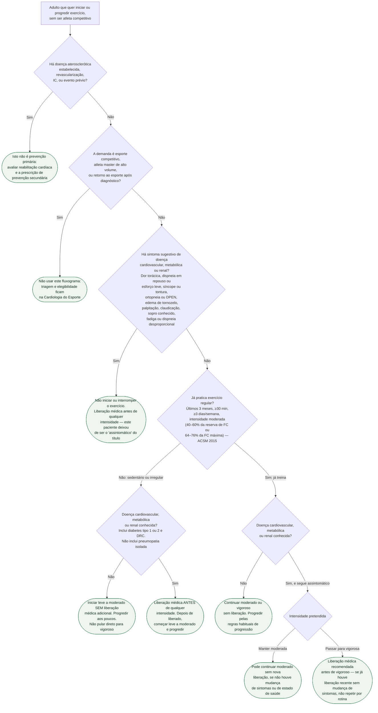

# Fluxograma: Avaliação pré-participação de exercício no adulto assintomático (não atleta)

A pergunta deste fluxograma é estreita: **este adulto, que não é atleta competitivo, precisa de liberação médica antes de começar ou de subir a intensidade do exercício?** Não é a pergunta da triagem pré-participação esportiva com ECG, nem a da indicação de reabilitação cardíaca.

O algoritmo que organiza os ramos é o da ACSM 2015 (Riebe et al., PMID 26473759). Ele abandonou a contagem de fatores de risco como critério de encaminhamento — a prevalência de fatores é alta e o evento relacionado ao exercício é raro, então o modelo antigo gerava encaminhamento excessivo e virava barreira. Ficaram três eixos: (1) a pessoa já treina com regularidade; (2) há sintomas sugestivos ou doença cardiovascular, metabólica ou renal conhecida; (3) a intensidade pretendida.

Diabetes tipo 1 ou 2 e doença renal entram no eixo de "doença conhecida" mesmo em prevenção primária de evento aterosclerótico. Doença pulmonar isolada **saiu** da lista que dispara encaminhamento automático: o risco de evento cardiovascular no exercício, nesse grupo, foi atribuído ao sedentarismo, não à pneumopatia em si.

## Árvore de decisão

## Como usar a árvore sem transformá-la em barreira

A ACC/AHA 2019 pede aconselhamento de rotina para um estilo de vida ativo (Classe I, B-R). O algoritmo ACSM existe para **não** mandar todo sedentário hipertenso ao teste ergométrico antes de caminhar. Whitfield et al. (2017), aplicando o algoritmo ao NHANES, mostraram o ponto: no sedentário assintomático **sem** as doenças especificadas, a conduta é começar leve a moderado sem liberação; no sedentário **com** doença conhecida, a liberação vem antes de qualquer intensidade.

"Liberação médica" neste fluxograma é avaliação clínica dirigida — história, exame, decisão sobre ECG ou teste funcional — não um carimbo e não um laudo de atleta. A SBC 2019, capítulo 8, descreve a avaliação inicial como **anamnese, exame físico e ECG**, e reserva teste ergométrico ou TCPE máximo para indicação **individualizada**, junto com antropometria, força e flexibilidade. Na consulta de prevenção primária brasileira isso já está acontecendo: o cardiologista que prescreve exercício já fez história e exame. O ECG de consultório não é o programa de Pádua. O teste de esforço não é pedágio da caminhada.

Depois da liberação, a ESC 2021 pede aumento **gradual** no sedentário. Intensidade moderada, na Tabela 4 da ACC/AHA 2019, é 3,0–5,9 METs (caminhada rápida, ciclismo leve, natação recreativa). Vigoroso é ≥6 METs. A prescrição do que fazer depois de passar pela árvore está no documento irmão.

## O que a árvore não é

**Não é triagem de atleta.** História direcionada a síncope de esforço, ECG com critérios de atleta, eco, Holter, decisão de elegibilidade — outra pasta, outros documentos. Quem caiu no ramo C00 deve sair daqui.

**Não é indicação de reabilitação cardíaca.** Doença estabelecida cai no ramo C0. Exercício e reabilitação na ESC 2024 de síndromes coronarianas crônicas (PMID 39210710) pertencem àquele documento, não a este.

**Não reintroduz contagem de fatores de risco como critério de encaminhamento.** Hipertensão, dislipidemia, idade, tabagismo e história familiar **não** disparam, sozinhos, o pedido de liberação no algoritmo ACSM 2015. Foi exatamente isso que a atualização removeu. Diabetes e DRC disparam porque estão na lista de doença metabólica/renal conhecida, não porque "somam pontos".

**Não autoriza ignorar sintoma novo em quem já treina.** O ramo do sintoma (C1) vale para o sedentário e para quem já corre: interromper, avaliar, só então retomar.

## Lista operacional de sintomas (ACSM)

A lista que o algoritmo trata como "sinais ou sintomas sugestivos" — e que tira o paciente do título "assintomático" — é:

- Dor ou desconforto (ou equivalente anginoso) em tórax, pescoço, mandíbula, braços ou outra área que possa ser isquemia
- Dispneia em repouso ou aos pequenos esforços
- Tontura ou síncope
- Ortopneia ou dispneia paroxística noturna
- Edema de tornozelo
- Palpitações ou taquicardia
- Claudicação intermitente
- Sopro conhecido
- Fadiga ou dispneia desproporcional às atividades habituais

Um único item positivo encerra o ramo "assintomático" e manda para avaliação, **independentemente** de a pessoa já treinar.

## Definição de "já treina"

Não é "caminha até o mercado". A ACSM 2015 classifica como exercício regular quem, **nos últimos 3 meses**, faz pelo menos **30 minutos**, em **3 ou mais dias por semana**, em intensidade **moderada** (40–60% da reserva de frequência cardíaca ou 64–76% da FC máxima). Quem está abaixo disso entra pelo ramo do sedentário — inclusive o paciente que "às vezes sobe escada" e se acha ativo.

## Depois da árvore

Quem caiu em C2 (sedentário assintomático sem doença conhecida) recebe a prescrição de prevenção primária e começa **leve a moderado**, com progressão. Quem caiu em C3 só recebe essa prescrição **depois** da avaliação. Quem caiu em C4 segue e pode progredir. O conteúdo da prescrição — 150–300 minutos de moderado ou 75–150 de vigoroso, resistido em 2 ou mais dias, reduzir tempo sedentário — está em `prescricao-de-exercicio-em-prevencao-primaria-cardiovascular.md`. Passos por dia e "guerreiro de fim de semana" são documentos de volume, não de triagem.

## Limitações e o que confirmar

- Os **três eixos** do algoritmo ACSM 2015 estão no abstract de Riebe et al., PMID 26473759 (atividade atual; sintomas e/ou doença CV, metabólica ou renal; intensidade desejada). A **figura original** do artigo não foi aberta em alta resolução nesta revisão editorial; os ramos operacionais reproduzidos no diagrama vêm dessa tríade mais a descrição padrão do algoritmo (incluindo Whitfield 2017, PMC7059860). Conferir a figura e a errata de 2016 (Med Sci Sports Exerc. 2016;48(3):579) antes de transformar o diagrama em protocolo institucional.
- A definição de exercício regular (30 min, 3 dias, 3 meses, moderado) é a do algoritmo ACSM reproduzida nas fontes secundárias lidas; está alinhada ao abstract, mas o número "30 minutos / 3 dias / 3 meses" deve ser conferido na figura/texto integral.
- "Liberação nos últimos 12 meses" para quem já treina, tem doença conhecida e quer vigoroso aparece em material didático ACSM; **LIMITE DA EVIDÊNCIA DISPONÍVEL** se esse prazo de 12 meses está no artigo de 2015 ou só em edições posteriores das Guidelines for Exercise Testing and Prescription.
- Pneumopatia fora da lista de encaminhamento automático: descrito nas fontes que reproduzem a justificativa do roundtable 2015; conferir no texto integral.
- A SBC 2019 é mais "ECG na avaliação inicial" do que a ACSM; as duas não se contradizem se o ECG não virar barreira para começar atividade leve a moderada no assintomático de baixo risco.
- Este fluxograma não decide sobre estatina, aspirina, escore de cálcio ou SCORE2/PREVENT — só sobre exercício.

## Tudo com Tudo

- [Prescrição de Exercício em Prevenção Primária Cardiovascular](/biblioteca/prescricao-de-exercicio-em-prevencao-primaria-cardiovascular)
- [Reabilitação Cardíaca e Prescrição de Exercício na Prevenção Secundária](/biblioteca/reabilitacao-cardiaca-e-prescricao-de-exercicio-na-prevencao-secundaria)
- [Passos por Dia e Mortalidade: o que Substitui a Meta dos 10 Mil](/biblioteca/passos-por-dia-e-mortalidade-o-que-substitui-a-meta-dos-10-mil)
- [Tempo Sentado e Atividade Física: a Dose que Anula o Risco](/biblioteca/tempo-sentado-e-atividade-fisica-a-dose-que-anula-o-risco)
- [Atividade Física Concentrada no Fim de Semana e Risco Cardiovascular](/biblioteca/atividade-fisica-concentrada-no-fim-de-semana-e-risco-cardiovascular)
- [Fadiga e Intolerância ao Esforço: Abordagem Cardiovascular Orientada à Decisão](/biblioteca/fadiga-e-intolerancia-ao-esforco-abordagem-cardiovascular-orientada-a-decisao)
- [Fluxograma: Fadiga e intolerância ao esforço — próximo passo](/biblioteca/fluxograma-fadiga-e-intolerancia-ao-esforco-proximo-passo)
