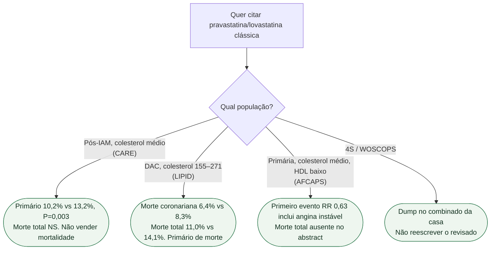

# Fluxograma: estatina clássica — o que cada um ganhou

```mermaid
flowchart TD
  R0["Quer citar pravastatina/lovastatina clássica"] --> D1{"Qual população?"}

  D1 -->|"Pós-IAM, colesterol médio<br/>(CARE)"| C1(["Primário 10,2% vs 13,2%, P=0,003<br/>Morte total NS. Não vender mortalidade"])

  D1 -->|"DAC, colesterol 155–271<br/>(LIPID)"| C2(["Morte coronariana 6,4% vs 8,3%<br/>Morte total 11,0% vs 14,1%. Primário de morte"])

  D1 -->|"Primária, colesterol médio, HDL baixo<br/>(AFCAPS)"| C3(["Primeiro evento RR 0,63 inclui angina instável<br/>Morte total ausente no abstract"])

  D1 -->|"4S / WOSCOPS"| C4(["Dump no combinado da casa<br/>Não reescrever o revisado"])

  classDef conduta fill:#eef6ef,stroke:#2f7a4f,color:#12301f;
  class C1,C2,C3,C4 conduta;
```

## Mensagem prática

**LIPID é o ensaio de morte.** CARE é composto, morte total empatou. AFCAPS inclui angina instável.
