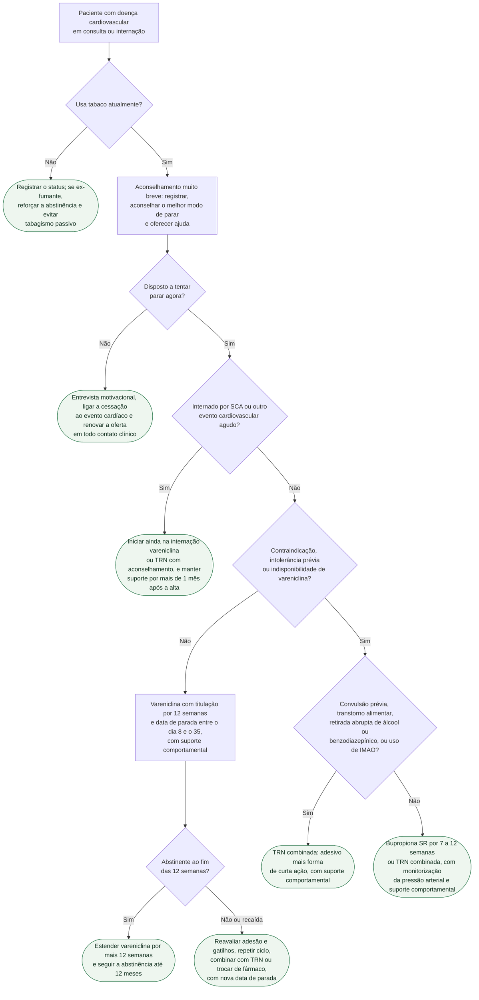

# Fluxograma: Cessação do tabagismo no cardiopata — abordagem breve, farmacoterapia e seguimento

Parar de fumar é, segundo a ESC 2021, potencialmente a mais eficaz de todas as medidas preventivas, com redução substancial de reinfarto e morte; a partir dos 45 anos o ganho em anos livres de doença cardiovascular é de 3 a 5 anos e persiste até os 65 anos em homens e 75 em mulheres. Mesmo assim, menos de um terço dos fumantes internados por síndrome coronariana aguda permanece abstinente depois da alta, e no seguimento de 1 ano do EVITA cerca de 60% dos tratados com vareniclina tinham voltado a fumar. A decisão que este fluxograma organiza é a de cada contato clínico: identificar o fumante, aconselhar em 30 segundos, medir a disposição e, quando ela existe, tratar com fármaco mais suporte comportamental — começando ainda no hospital quando o gatilho é um evento agudo.

## Árvore de decisão

O que vale para todos os ramos e ficou fora do diagrama: o suporte comportamental acompanha qualquer fármaco (no EAGLES, todos os braços receberam aconselhamento breve em cada visita); a pergunta sobre tabaco se repete em toda consulta; e o seguimento de 12 semanas e a conduta na recaída, desenhados sob o ramo da vareniclina, aplicam-se igualmente a bupropiona e TRN.

## Perguntar, aconselhar, oferecer: o aconselhamento muito breve

A ESC 2021 recomenda parar todo uso de tabaco (Classe I, nível A) e, nos fumantes, considerar suporte de seguimento, terapia de reposição de nicotina, vareniclina e bupropiona, isoladamente ou em combinação (Classe IIa, nível A). A cessação é recomendada independentemente do ganho de peso (Classe I, nível B): o ganho médio esperado é de 5 kg e não anula o benefício.

O aconselhamento muito breve da Tabela 9 da diretriz é uma intervenção de 30 segundos em três passos — registrar o status tabágico, aconselhar sobre o melhor modo de parar e oferecer ajuda. O momento do diagnóstico ou do tratamento de doença cardiovascular é o principal impulso para a cessação; combinar um plano específico com arranjo de seguimento é intervenção baseada em evidência.

## Quem não está disposto: entrevista motivacional e nova oferta

A recusa não encerra o assunto. A revisão sistemática de Lee (ver entrevista-motivacional-para-mudanca-de-estilo-de-vida-revisao-sistematica) encontrou entrevista motivacional mais eficaz que o cuidado usual para alterar o hábito tabágico, ainda que inconclusiva para a maioria dos outros desfechos. A ESC observa que persistência e recaída são comuns no coronariopata, sobretudo com depressão grave e exposição ambiental, e que terapias de manejo do humor podem melhorar o resultado em quem tem depressão atual ou prévia. Enquanto o paciente não aceita tratar, reduzir o tabagismo passivo em casa já tem valor (ver tabagismo-passivo-e-risco-cardiovascular-da-dose-nao-linear-a-lei-antifumo).

## SCA recente: começar na internação

A ESC 2021 afirma que a vareniclina iniciada no hospital após SCA é eficaz e segura, citando o EVITA. No ensaio, 302 fumantes internados por SCA (56% com IAM com supra, 38% sem supra, 6% angina instável) foram randomizados ainda na internação para vareniclina ou placebo por 12 semanas, com aconselhamento de baixa intensidade em ambos os braços. Aos 6 meses a abstinência pontual foi de 47,3% contra 32,5% (P = 0,012; NNT 6,8) e a contínua de 35,8% contra 25,8% (P = 0,081); eventos adversos graves (11,9% vs 11,3%) e eventos cardiovasculares maiores (4,0% vs 4,6%) não diferiram. No seguimento de 1 ano, a abstinência pontual foi de 39,9% contra 29,1% (NNT 10) e os eventos cardiovasculares maiores, 8,6% contra 9,3%.

A TRN não mostra efeito adverso no paciente com doença aterosclerótica segundo a ESC, e a revisão Cochrane 2024 de pacientes internados encontrou benefício da TRN sobre placebo (RR 1,33; IC95% 1,05–1,67) e maior taxa de cessação quando o aconselhamento começa no hospital e continua por mais de 1 mês após a alta (RR 1,36; IC95% 1,24–1,49). É por isso que a conduta do ramo agudo inclui o seguimento pós-alta como parte do tratamento, não como opcional — o encaminhamento natural é a reabilitação cardíaca (ver reabilitacao-cardiaca-e-prescricao-de-exercicio-na-prevencao-secundaria).

## Escolha do fármaco: vareniclina primeiro, bupropiona como alternativa

No EAGLES, com 8.144 participantes, a vareniclina 1 mg 2x/dia superou placebo (OR 3,61; IC95% 3,07–4,24), adesivo de nicotina (OR 1,68; 1,46–1,93) e bupropiona (OR 1,75; 1,52–2,01) na abstinência contínua das semanas 9–12, sem aumento significativo de eventos neuropsiquiátricos, inclusive na coorte com transtorno psiquiátrico. A ESC repete a hierarquia com a metanálise em rede de pacientes com doença aterosclerótica: vareniclina RR 2,6, bupropiona RR 1,4, aconselhamento individual RR 1,6, terapia por telefone RR 1,5; e afirma que vareniclina, bupropiona e TRN não aumentam o risco de evento cardiovascular grave durante ou após o tratamento. A bula da Chantix mantém alerta de eventos cardiovasculares com base num ensaio em doença cardiovascular estável (infarto não fatal 1,1% vs 0,3%) e numa metanálise de 15 ensaios com HR 1,95 para MACE, não significativa (IC95% 0,79–4,82).

A alternativa à vareniclina é a TRN combinada — adesivo mais uma forma de curta ação —, que na revisão Cochrane de Theodoulou superou a forma única (RR 1,27; IC95% 1,17–1,37; 16 estudos, 12.169 participantes, alta certeza); a ESC acrescenta que goma de 4 mg supera a de 2 mg. A bupropiona SR tem eficácia semelhante à TRN e entra quando a nicotina é recusada ou quando há depressão que a favoreça, desde que não haja contraindicação: a bula lista transtorno convulsivo, bulimia ou anorexia atual ou prévia, retirada abrupta de álcool, benzodiazepínicos, barbitúricos ou antiepilépticos, uso de IMAO nos últimos 14 dias e hipersensibilidade. A incidência de convulsão com a formulação SR até 300 mg/dia é de cerca de 0,1% e sobe para cerca de 0,4% até 400 mg/dia. A combinação de bupropiona com adesivo produziu hipertensão emergente em 6,1% contra 2,5% com bupropiona isolada, 1,6% com adesivo e 3,1% com placebo — daí a monitorização da pressão no ramo correspondente.

## Doses

| Fármaco | Esquema | Duração e ajustes | Fonte lida |
|---|---|---|---|
| Vareniclina | 0,5 mg 1x/dia nos dias 1–3; 0,5 mg 2x/dia nos dias 4–7; 1 mg 2x/dia a partir do dia 8. Começar 1 semana antes da data de parada ou parar entre o dia 8 e o 35; quem não consegue parar de uma vez pode reduzir 50% a cada 4 semanas ao longo de 12 semanas e seguir por mais 12 | 12 semanas; mais 12 semanas nos que pararam, para reduzir recaída. ClCr abaixo de 30 mL/min: máximo 0,5 mg 2x/dia; diálise: 0,5 mg 1x/dia se tolerado. Contraindicação: hipersensibilidade grave ou reação cutânea prévia | Bula Chantix, DailyMed, rev. 6/2025 |
| Bupropiona SR | 150 mg 1x/dia por 3 dias, depois 150 mg 2x/dia com intervalo mínimo de 8 h; máximo 300 mg/dia; iniciar cerca de 1 semana antes da data de parada, fixada nas 2 primeiras semanas | 7 a 12 semanas; prolongar é decisão individual. Insuficiência hepática moderada a grave: máximo 150 mg em dias alternados; renal: reduzir dose ou frequência. Aferir pressão antes e durante | Bula Zyban, FDA, rev. 6/2016 |
| Adesivo de nicotina | 21 mg/dia com desmame, esquema do braço do EAGLES; associar forma de curta ação (goma de 4 mg preferível à de 2 mg segundo a ESC) | 12 semanas no EAGLES. Escala de dose do adesivo por cigarros/dia e duração padrão do desmame: VERIFICAÇÃO HUMANA NECESSÁRIA | EAGLES (acervo), ESC 2021, Cochrane 2023 |

## Seguimento e recaída

A tabela de recomendações da ESC coloca o suporte de seguimento no mesmo item que os fármacos, e a bula da bupropiona diz o mesmo em outras palavras: quem não parou após 7 a 12 semanas dificilmente para naquela tentativa, deve ter o tratamento reavaliado e ser encorajado a nova tentativa quando os fatores da falha puderem ser removidos. Dependência de tabaco é condição crônica; a recaída não é contraindicação a repetir o mesmo fármaco, estender a duração, combinar com TRN ou trocar de classe. A abstinência aos 6 meses de um tratamento de 12 semanas não é cessação definitiva — o seguimento de 1 ano do EVITA mostra por quê.

Sobre cigarro eletrônico: a ESC 2021 reconhece evidência recente de que é provavelmente mais eficaz que a TRN para cessação, mas exige mais pesquisa sobre efeito cardiovascular e pulmonar de longo prazo, condena o uso duplo com cigarro e pede controle de marketing igual ao do tabaco; o documento do acervo sobre vaping detalha a fragilidade da literatura (ver cigarro-eletronico-vaping-e-risco-cardiometabolico). Não está no diagrama porque a diretriz não o recomenda como conduta.

## Limitações e o que confirmar

- Escala de dose do adesivo de nicotina por número de cigarros/dia e a duração padrão do desmame não foram lidas em bula ou diretriz nesta sessão: VERIFICAÇÃO HUMANA NECESSÁRIA antes de prescrever a partir da tabela.
- Os números do EVITA, do EAGLES e das revisões Cochrane vêm dos abstracts e do documento do acervo, não do texto integral; a ESC 2021 foi lida no PDF integral.
- A bula da Zyban usada é a versão da FDA de 2016, a mais recente aberta nesta sessão; o DailyMed não tem mais rótulo ativo da marca. A posologia brasileira de bupropiona e de vareniclina (Anvisa) não foi conferida.
- A ESC 2021 classifica a farmacoterapia como IIa A em bloco, sem hierarquizar vareniclina sobre os demais; a ordem de escolha desta árvore vem do EAGLES e da metanálise em rede citada pela diretriz, não de uma recomendação com classe própria.
- O EVITA excluiu pacientes sem motivação para parar e teve 302 participantes; o desfecho de segurança cardiovascular é subdimensionado, e os próprios autores pedem estudos maiores.
- A citisina, mencionada pela ESC como eficaz mas de evidência limitada e pouco disponível, ficou fora da árvore.

## Tudo com Tudo

- [Tratamento Farmacológico da Cessação Tabágica: o Ensaio EAGLES](/biblioteca/tratamento-farmacologico-da-cessacao-tabagica-o-ensaio-eagles)
- [Entrevista Motivacional para Mudança de Estilo de Vida: Revisão Sistemática](/biblioteca/entrevista-motivacional-para-mudanca-de-estilo-de-vida-revisao-sistematica)
- [Reabilitação Cardíaca e Prescrição de Exercício na Prevenção Secundária](/biblioteca/reabilitacao-cardiaca-e-prescricao-de-exercicio-na-prevencao-secundaria)
- [Fluxograma: Síndrome Coronariana Aguda — do primeiro contato à reperfusão (ESC 2023)](/biblioteca/fluxograma-sindrome-coronariana-aguda-esc-2023)
- [Tabagismo Passivo e Risco Cardiovascular: da Dose Não Linear à Lei Antifumo](/biblioteca/tabagismo-passivo-e-risco-cardiovascular-da-dose-nao-linear-a-lei-antifumo)
- [Cigarro Eletrônico (Vaping) e Risco Cardiometabólico](/biblioteca/cigarro-eletronico-vaping-e-risco-cardiometabolico)
