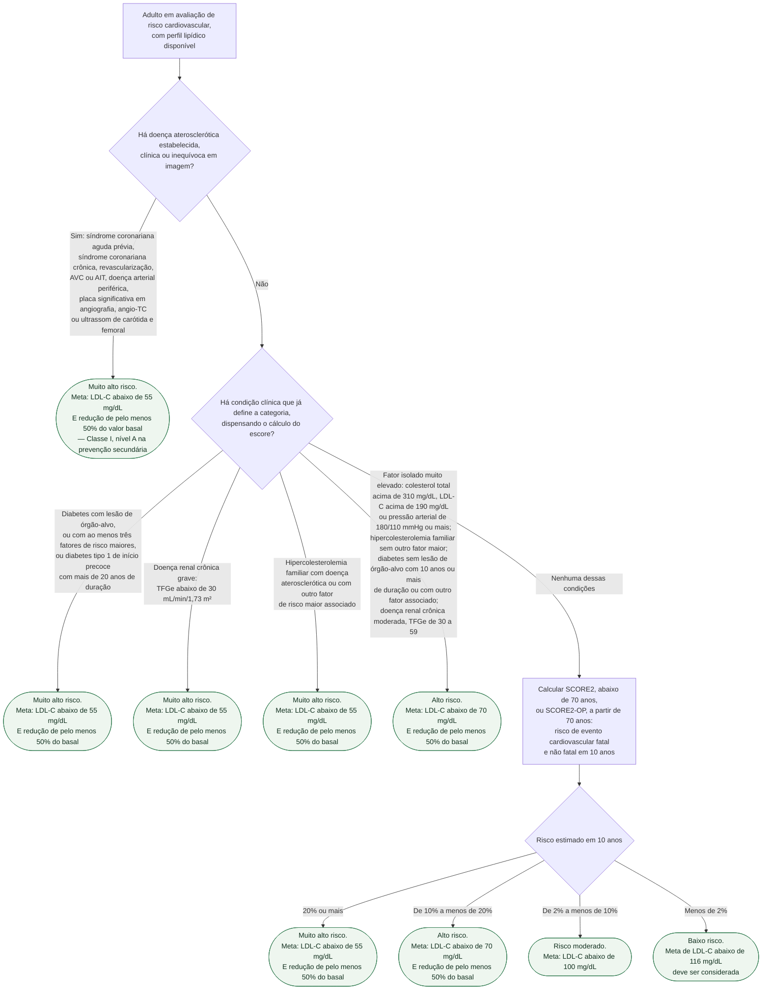
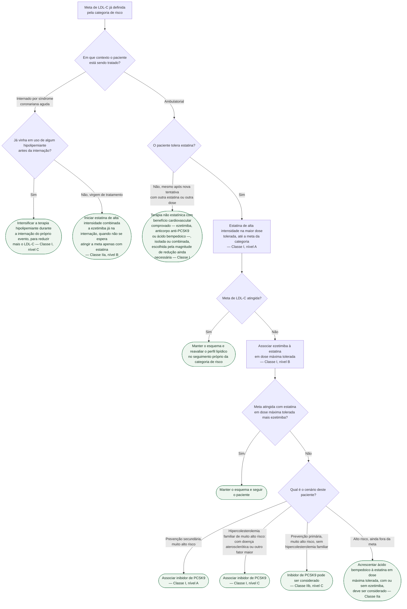

# Fluxograma: Dislipidemia — categoria de risco, meta de LDL-C e escalonamento do tratamento (ESC/EAS 2025)

A atualização focada de 2025 **não mexeu nas metas de LDL-C**. Ela mexeu em duas
outras coisas, e é por isso que vale um fluxograma novo:

- **Como se chega à categoria de risco.** O SCORE saiu; entraram **SCORE2 e
  SCORE2-OP**, que estimam evento cardiovascular **fatal e não fatal** em 10 anos —
  e não mais só mortalidade. Os pontos de corte foram convertidos por um
  multiplicador, o que explica por que os números novos são o dobro dos antigos.
- **Quando intensificar.** Na síndrome coronariana aguda, a intensificação passou
  a ser recomendada **durante a internação do próprio evento**, em vez de esperar
  a reavaliação ambulatorial.

Duas armadilhas que o desenho da árvore torna visíveis: a categoria de risco quase
sempre é decidida **antes** de qualquer escore — doença aterosclerótica
estabelecida, diabetes com lesão de órgão-alvo, doença renal crônica grave e
hipercolesterolemia familiar já classificam o paciente sozinhas; e a meta de risco
alto e muito alto é **dupla** — o valor absoluto *e* a redução de pelo menos 50%
do basal, sendo que atingir um sem o outro não cumpre a recomendação.

## Árvore de decisão: categoria de risco e meta de LDL-C

## Árvore de decisão: escalonamento do tratamento hipolipemiante

## As metas, reunidas

A atualização de 2025 declara explicitamente que estas metas **não mudaram** em
relação a 2019.

| Categoria | Meta de LDL-C | Também |
|---|---|---|
| Muito alto risco | abaixo de 55 mg/dL, ou 1,4 mmol/L | redução de pelo menos 50% do basal |
| Alto risco | abaixo de 70 mg/dL, ou 1,8 mmol/L | redução de pelo menos 50% do basal |
| Risco moderado | abaixo de 100 mg/dL, ou 2,6 mmol/L | — |
| Baixo risco | abaixo de 116 mg/dL, ou 3,0 mmol/L | deve ser considerada |

**Metas secundárias**, para quando o LDL-C isolado não conta a história toda —
hipertrigliceridemia, diabetes, síndrome metabólica, LDL-C muito baixo:

| | Muito alto risco | Alto risco | Risco moderado |
|---|---|---|---|
| Não-HDL-C | abaixo de 85 mg/dL | abaixo de 100 mg/dL | abaixo de 130 mg/dL |
| ApoB | abaixo de 65 mg/dL | abaixo de 80 mg/dL | abaixo de 100 mg/dL |

## O paciente que volta a ter evento: a meta abaixo de 40 mg/dL

Para quem tem doença aterosclerótica e **sofre um segundo evento vascular em até
2 anos** — não necessariamente do mesmo tipo do primeiro — já em uso de estatina
na dose máxima tolerada, uma meta de LDL-C **abaixo de 40 mg/dL, ou 1,0 mmol/L,
pode ser considerada: Classe IIb, nível B**.

Repare no que a classe diz e no que não diz. IIb é o degrau mais fraco entre as
recomendações a favor — a diretriz abre a porta, não empurra o paciente por ela.
E o gatilho é específico: **evento recorrente em janela de 2 anos, já sob
tratamento**, não "paciente grave" em sentido genérico.

## O que as árvores não mostram

**Lipoproteína(a) deve ser dosada ao menos uma vez na vida.** É determinada
geneticamente e praticamente não varia ao longo da vida, então uma única
dosagem basta. Valores **acima de 50 mg/dL, ou 105 nmol/L, devem ser
considerados fator agravante de risco cardiovascular em todo adulto — Classe
IIa, nível B** —, e quanto mais alta a Lp(a), maior o acréscimo de risco. Ela não
entra como ramo porque não muda a meta: reclassifica o risco, que é o que a
primeira árvore já faz.

**Modificadores de risco não são ramos, e por bom motivo.** Aterosclerose
coronariana subclínica, escore de cálcio coronariano elevado e proteína C-reativa
de alta sensibilidade acima de 2 mg/L refinam a estimativa do SCORE2 no paciente
de risco limítrofe. Colocá-los na árvore transformaria uma decisão de reclassificação
em uma cascata de ramos que ninguém percorre à beira do leito — o lugar deles é a
prosa e o julgamento clínico.

**Estilo de vida não desaparece porque não está desenhado.** Dieta, peso,
atividade física e cessação do tabagismo são a base sobre a qual toda a árvore
farmacológica se apoia, em qualquer categoria.

**Populações que a atualização de 2025 tratou à parte**, cada uma com recomendação
própria: pessoas vivendo com HIV a partir de 40 anos em prevenção primária
— estatina recomendada independentemente do risco estimado e do LDL-C, Classe I,
nível B —; pacientes sob quimioterapia com antraciclina e alto ou muito alto risco
de cardiotoxicidade — estatina deve ser considerada, Classe IIa, nível B —;
hipercolesterolemia familiar homozigótica a partir dos 5 anos fora da meta apesar
de terapia máxima — evinacumabe deve ser considerado, Classe IIa, nível B —; e
hipertrigliceridemia grave da síndrome de quilomicronemia familiar, acima de
750 mg/dL — volanesorsena 300 mg por semana deve ser considerada, Classe IIa,
nível B.

**Suplemento alimentar e vitamina não têm lugar aqui.** A diretriz é explícita:
não há indicação para reduzir LDL-C nem risco aterosclerótico — **Classe III,
nível B**. É recomendação contra, não ausência de recomendação.

## Uma nota de procedência sobre esta página

O nível de evidência das duas recomendações de **ácido bempedoico** não pôde ser
lido com segurança na extração do PDF da diretriz — a fonte do documento é
subconjunto sem mapa de caracteres, e os glifos de classe e nível saem ambíguos.
A **classe** está afirmada aqui a partir da redação literal da própria diretriz,
usando a convenção de linguagem que ela define ("é recomendado" para Classe I,
"deve ser considerado" para Classe IIa). O nível correspondente é
`VERIFICAÇÃO HUMANA NECESSÁRIA` — conferir na Tabela de Recomendação 2 impressa
antes de considerar esta página fechada.

Todo o restante — metas, categorias de risco, classes e níveis de estatina,
ezetimiba, inibidor de PCSK9, síndrome coronariana aguda, Lp(a) e populações
especiais — foi lido diretamente do texto das diretrizes de 2019 e 2025.
