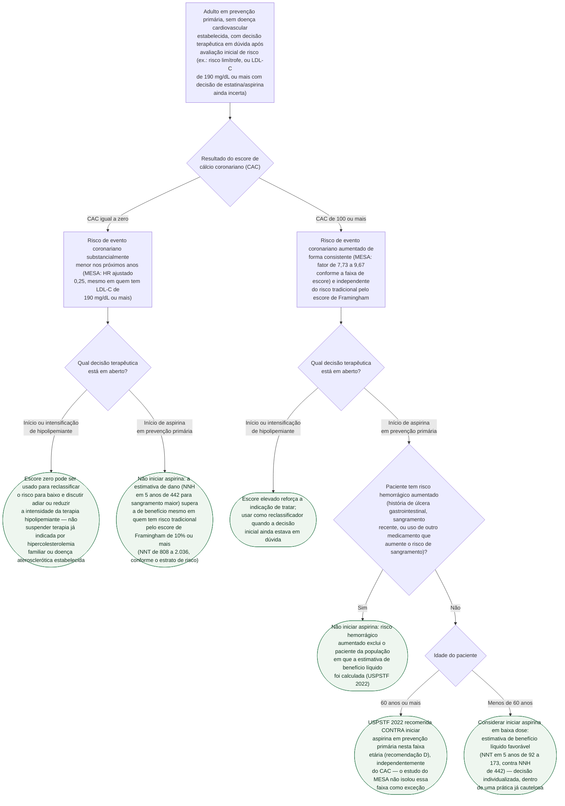

# Fluxograma: Escore de Cálcio Coronariano na Decisão de Estatina e de Aspirina em Prevenção Primária

O escore de cálcio coronariano (CAC) é usado na prática para duas decisões diferentes, e os dois documentos já publicados nesta pasta — sobre o que o MESA mediu e sobre o NNT/NNH da aspirina guiada por CAC — tratam de cada uma separadamente. Este fluxograma reúne as duas num único ponto de entrada: **o mesmo resultado de CAC leva a condutas diferentes conforme a decisão em aberto seja sobre hipolipemiante ou sobre aspirina.**

Um resultado importante orienta toda a árvore: o CAC **reclassifica** risco de forma consistente e independente do escore de risco tradicional (Framingham) — inclusive quando o LDL-C já é muito alto (190 mg/dL ou mais). Fora dos dois valores usados nos estudos que embasam esta árvore (CAC igual a zero e CAC de 100 ou mais), a faixa intermediária de CAC (entre 1 e 99) não foi estratificada com o mesmo detalhe por nenhuma das fontes aqui citadas para a decisão de aspirina — nesse caso, a decisão volta a se apoiar no risco tradicional e no julgamento clínico, sem um corte numérico específico desta árvore.

## Árvore de decisão

## O que a árvore não mostra

**As estimativas de NNT/NNH da aspirina são modelagem, não ensaio randomizado.** Miedema et al. cruzaram taxas de evento observadas no MESA com uma redução relativa de risco vinda de outra fonte (metanálise) — ninguém no MESA foi alocado a receber ou não aspirina conforme o CAC.

**A recomendação de aspirina mudou depois do estudo que gerou os números de NNT/NNH (2014).** O USPSTF 2022 já é mais restritivo do que a prática da época, incorporando três ensaios randomizados posteriores (ASPREE, ASCEND, ARRIVE); os números desta árvore refinam a decisão **dentro** dessa prática já cautelosa, não a revertem.

**O escore de cálcio não mede estenose nem substitui teste funcional** — não deve ser pedido para investigar dor torácica aguda, e um escore zero não descarta doença coronariana em paciente sintomático, porque placa não calcificada existe.

**Escore zero não é permanente**: descreve o risco dos próximos anos, não da vida inteira, e a repetição do exame depende do risco basal e do que a repetição mudaria na conduta.
