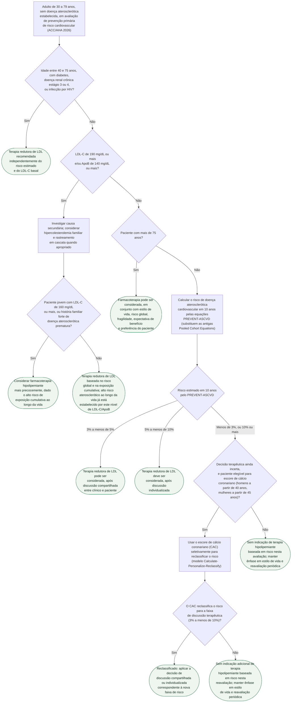

# Fluxograma: Estatina em Prevenção Primária — Decisão de Tratar pela ACC/AHA 2026 (PREVENT-ASCVD)

O fluxograma já publicado nesta pasta ("Dislipidemia — categoria de risco, meta de LDL-C e escalonamento") cobre a diretriz **ESC/EAS 2025**: como o SCORE2 define a categoria de risco e a meta de LDL-C, e como escalonar o tratamento hipolipemiante depois que a estatina já foi iniciada. Este fluxograma cobre uma pergunta anterior e sob outra diretriz — a **ACC/AHA 2026** —: **quando considerar iniciar** a terapia redutora de LDL em prevenção primária, antes de qualquer meta numérica entrar em jogo.

A diferença estrutural entre as duas diretrizes é o que torna este segundo ângulo necessário: a americana de 2026 substitui as antigas Pooled Cohort Equations pelas equações **PREVENT-ASCVD**, mantém condições que dispensam o cálculo de risco (diabetes, doença renal crônica, HIV), separa a hipercolesterolemia grave (LDL-C ou ApoB muito elevados) como via própria, e usa o escore de cálcio coronariano (CAC) apenas para **reclassificar** quando a decisão permanece incerta — não como rastreamento indiscriminado.

## Árvore de decisão

## O que a árvore não mostra

**Lp(a) deve ser medida ao menos uma vez** em todo adulto, independentemente do ramo desta árvore — não muda a decisão inicial de tratar, mas reclassifica risco quando elevada (1,4 vez o risco em 125 nmol/L ou mais; cerca de 2 vezes em 250 nmol/L ou mais) e reforça a intensificação dos fatores modificáveis.

**ApoB** é ferramenta de refinamento, não de decisão inicial: mais útil quando há discordância entre LDL-C e a carga de partículas aterogênicas (triglicerídeos acima de 200 mg/dL, diabetes, LDL-C já abaixo de 70 mg/dL sem meta secundária atingida).

**Hipertrigliceridemia** não é um ramo à parte para prevenção aterosclerótica: a estatina continua sendo a base farmacológica mesmo nesse cenário. Triglicerídeos de 1.000 mg/dL ou mais justificam terapia específica adicional, mas com o objetivo distinto de prevenir pancreatite, não de reduzir placa.

**Esta diretriz americana não deve ser lida como equivalente à ESC/EAS 2025.** As duas convergem em princípios, mas usam estruturas e algoritmos próprios — uma meta ou classe de recomendação de uma sociedade não deve ser atribuída à outra por analogia, e o fluxograma de escalonamento hipolipemiante já publicado nesta pasta segue a estrutura europeia, não esta.
