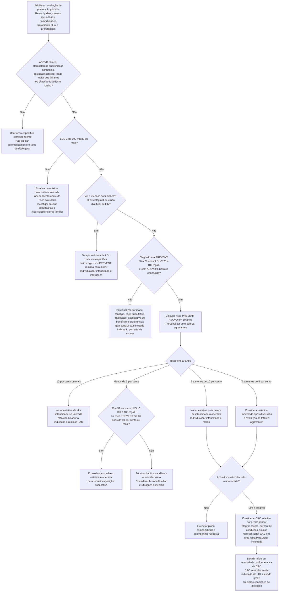

# Fluxograma: Estatina em Prevenção Primária — ACC/AHA 2026

Este roteiro orienta a decisão inicial de reduzir LDL-C segundo a **ACC/AHA 2026**. O PREVENT-ASCVD é aplicado na população apropriada, não substitui vias específicas de doença aterosclerótica já conhecida, hipercolesterolemia grave ou situações especiais, e não deve ser confundido com SCORE2/ESC. Estilo de vida e decisão compartilhada acompanham todos os caminhos.

## Árvore de decisão

## Pontos que mudam a decisão

**Alto risco não é ausência de indicação.** PREVENT-ASCVD ≥10% conduz a estatina de alta intensidade quando tolerada; LDL-C ≥190 mg/dL tem indicação pela hipercolesterolemia grave independentemente do escore. CAC não é requisito para tratar esses grupos. No risco intermediário (5% a <10%), a recomendação é pelo menos estatina moderada; risco limítrofe (3% a <5%) exige discussão dos agravantes e do benefício esperado. Em 30–59 anos com risco de 10 anos baixo, LDL-C 160–189 mg/dL ou risco de 30 anos ≥10% pode justificar terapia moderada.

**CAC é seletivo.** Pode esclarecer decisões incertas, principalmente no risco limítrofe/intermediário, em homens a partir de 40 anos e mulheres a partir de 45 anos. Sua interpretação considera valor absoluto, percentil e contexto; não existe neste roteiro uma conversão de CAC para “PREVENT 3%–10%”. Um CAC zero não exclui placa não calcificada e não deve apagar indicações independentes ou fatores de alto risco. A decisão de adiar tratamento precisa respeitar a diretriz, inclusive contexto de diabetes, tabagismo, hipercolesterolemia familiar e história familiar forte.

**Lp(a) e ApoB podem influenciar o plano.** Medir Lp(a) pelo menos uma vez na vida adulta; elevação é agravante de risco e pode modificar a decisão/intensidade. ApoB é útil de forma seletiva, especialmente na discordância entre LDL-C e número de partículas aterogênicas, em hipertrigliceridemia, diabetes e risco residual. Não apresentá-las como incapazes de mudar a decisão inicial.

**Hipertrigliceridemia exige avaliação própria.** Corrigir causas secundárias, dieta e risco aterosclerótico; não esperar triglicerídeos chegarem a 1.000 mg/dL para reconhecer risco de pancreatite e necessidade de manejo específico. Elevação grave, sintomas abdominais e condições associadas mudam a urgência e a estratégia. As opções para pancreatite e para redução de eventos ateroscleróticos têm objetivos e critérios distintos.

**Populações especiais não são um “não tratar”.** DRC em diálise, gestação/lactação, crianças, LDL fora da faixa do escore e idosos com fragilidade/benefício limitado exigem recomendações próprias. Após 75 anos, individualizar início ou continuidade conforme condição funcional, expectativa de benefício, tolerância e preferências, sem negar tratamento apenas pela idade nem impor uma intensidade universal.

Após decidir tratar, avaliar resposta lipídica, tolerância e metas correspondentes ao risco. O acompanhamento e eventual associação de outros agentes seguem a diretriz vigente; não suspender estatina ou terapia essencial automaticamente por sintoma inespecífico.

Fonte operacional primária: [AHA/ACC 2026 — uso de PREVENT-ASCVD para manejo lipídico, material oficial para clínicos](https://professional.heart.org/en/science-news/-/media/731B2098BB23427F9EA8EDDF98E08145.ashx), seções 4.2.3.2 e 4.2.3.7 e tabela de tratamento por faixa de risco. [Página oficial da diretriz](https://professional.heart.org/en/science-news/2026-guideline-on-the-management-of-dyslipidemia).
