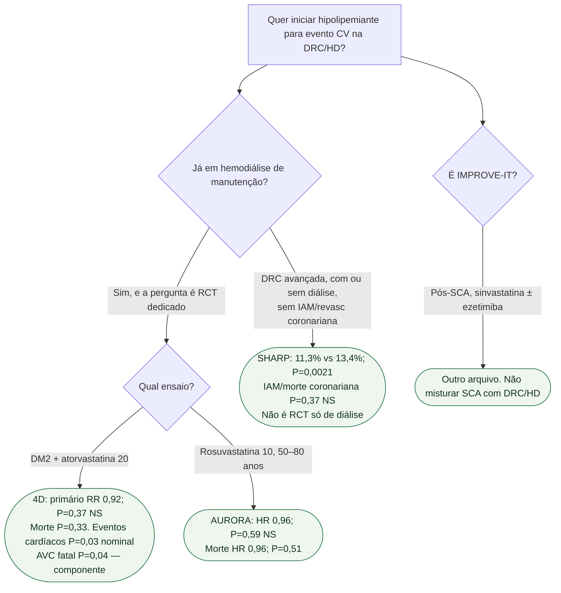

# Fluxograma: DRC ou já em diálise?

## Mensagem prática

**SHARP responde DRC mista e composto aterosclerótico — não mortalidade.** **4D e AURORA respondem HD dedicada e são NS no primário.** Não anular os dois com o subgrupo de diálise do SHARP.
