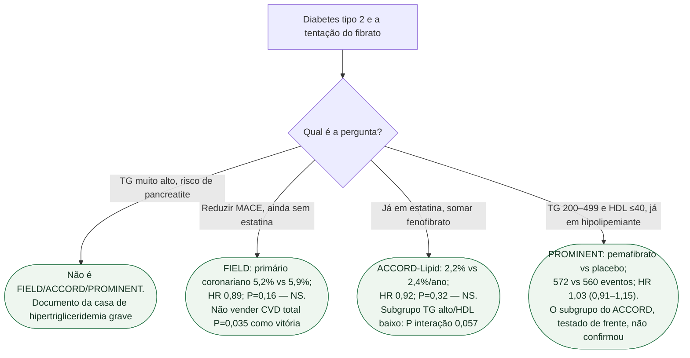

# Fluxograma: fibrato para evento cardiovascular — os três primários

## Mensagem prática

**Fibrato não é terapia de MACE no diabetes.** Três primários, três falhas. A estatina (e o que vier depois dela: ezetimiba, PCSK9, bempedoico) é o hipolipemiante de desfecho. TG grave continua outra conversa.
