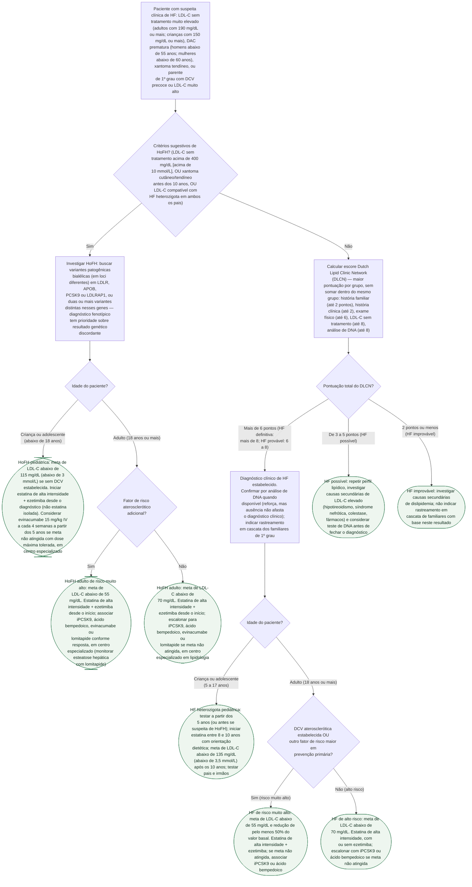

# Fluxograma: Hipercolesterolemia Familiar — Diagnóstico pelo Escore Dutch Lipid Clinic Network e Manejo (ESC/EAS 2025)

A hipercolesterolemia familiar (HF) é subdiagnosticada porque seu critério mais usado — o escore da **Dutch Lipid Clinic Network (DLCN)** — não é um corte único, e sim uma pontuação por categorias (história familiar, história clínica, exame físico, LDL-C e DNA) em que só a maior pontuação de cada grupo conta. Este fluxograma organiza duas decisões em sequência: primeiro, separar a forma **homozigota (HoFH)** — rara, com cortes e fármacos próprios — da investigação padrão por DLCN; depois, uma vez estabelecido o diagnóstico, levar à meta de LDL-C e à conduta certas conforme idade e categoria de risco.

**O que a árvore não resolve sozinha**: o diagnóstico definitivo de HF é clínico, não genético — a ausência de mutação identificada não afasta HF quando o quadro clínico é característico, e o inverso (variante encontrada sem fenótipo) também não basta isoladamente. Rastreamento em cascata dos familiares de 1º grau é parte do manejo, não um extra.

## Árvore de decisão

## O que a árvore não mostra

**O DLCN não soma pontos dentro do mesmo grupo** — só a maior pontuação de cada uma das cinco categorias entra na soma final. Um paciente com xantoma tendíneo (6 pontos) e arco corneano antes dos 45 anos (4 pontos) pontua 6, não 10, porque os dois pertencem ao grupo de exame físico.

**Teste de DNA negativo não descarta HF.** A diretriz recomenda a confirmação genética quando disponível, mas o diagnóstico clínico por DLCN é suficiente para tratar — a ausência de mutação identificável não afasta HF clinicamente definida, porque nem toda causa genética de HF já foi mapeada.

**Em HoFH, o fenótipo tem prioridade sobre o genótipo quando os dois divergem** — um paciente com quadro clínico de HoFH (LDL-C muito alto desde a infância, xantomas precoces) é tratado como HoFH mesmo que o teste genético não confirme variantes bialélicas, e o inverso também vale: variantes bialélicas sem o fenótipo típico não bastam isoladamente.

**A conversão de Lp(a) entre mg/dL e nmol/L não é exata** (o tamanho da isoforma de apolipoproteína(a) varia entre indivíduos) — não é mostrada nesta árvore, mas deve entrar na avaliação de risco de todo paciente com HF, já que a diretriz recomenda medir Lp(a) ao menos uma vez na vida.

**Esta árvore não cobre suplementos ou vitaminas como alternativa a estatina** — a atualização ESC/EAS 2025 recomenda explicitamente contra essa estratégia (Classe III, Nível B) para reduzir risco de DCV aterosclerótica, independentemente da categoria de risco.
