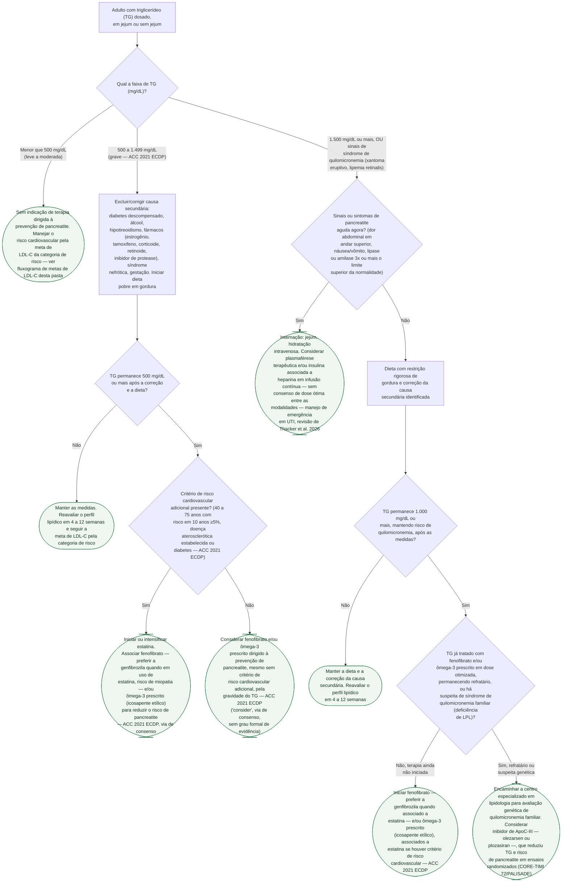

# Fluxograma: Hipertrigliceridemia Grave — Manejo e Prevenção de Pancreatite Aguda (ACC 2021 ECDP)

O triglicerídeo (TG) elevado tem dois desfechos clínicos que pedem condutas diferentes: o
**cardiovascular** aterosclerótico, já coberto pelos demais fluxogramas desta pasta, e a
**pancreatite aguda**, complicação da hipertrigliceridemia grave por lesão direta do parênquima
pancreático pelo excesso de quilomícrons circulantes. Esta árvore organiza a segunda pergunta —
quando o TG por si só justifica conduta dirigida à prevenção ou ao tratamento agudo da
pancreatite, e com qual fármaco escalonar quando a primeira linha não resolve.

**A referência de classificação histórica (Endocrine Society 2012) foi formalmente retirada em
2025.** A conduta farmacológica ativa desta árvore vem do *2021 ACC Expert Consensus Decision
Pathway* (Virani et al.), documento cardiológico dedicado, publicado depois da retirada e ainda
vigente — mas é via de decisão por consenso de especialistas ("consider"), não recomendação com
grau formal de evidência como a diretriz retirada. A coorte de Copenhague mostra que o risco
relativo de pancreatite já sobe a partir de 177 mg/dL — bem abaixo do limiar em que a árvore indica
tratamento farmacológico dirigido — e essa distinção entre "risco mensurável" e "indicação de
tratamento" é o que evita a leitura fácil de tratar todo TG moderado com fibrato.

## Árvore de decisão

## As faixas, reunidas

| Faixa de TG | Classificação | O que muda na conduta |
|---|---|---|
| Menor que 500 mg/dL | Leve a moderada | Sem terapia dirigida à pancreatite; segue meta de LDL-C |
| 500 a 999 mg/dL | Grave | Corrigir causa secundária + dieta; fármaco se persistir |
| 1.000 a 1.999 mg/dL | Muito grave (nomenclatura histórica) | Mesmo caminho da faixa grave, risco de quilomicronemia maior |
| 1.500 mg/dL ou mais, com xantoma eruptivo/lipemia retinalis | Síndrome de quilomicronemia plenamente manifesta | Investigar causa genética; considerar inibidor de ApoC-III se refratário |
| Qualquer faixa, com dor abdominal + lipase/amilase 3x o limite | Pancreatite aguda em curso | Internação e manejo de emergência, nunca conduta ambulatorial |

## O que a árvore não mostra

**O gradiente de risco começa muito antes do limiar de tratamento.** A coorte de Copenhague mostra
risco de pancreatite aguda já elevado a partir de 177 mg/dL (HR 1,6), com tendência dose-resposta
p = 6×10⁻⁸ — dentro da faixa que a árvore trata como "sem indicação de terapia dirigida". As duas
informações não se contradizem: a coorte mede associação epidemiológica ao longo de todo o
espectro; a árvore aplica o ponto em que a intervenção farmacológica dirigida à prevenção de
pancreatite está de fato recomendada, que é bem mais alto.

**O ACC 2021 ECDP não é diretriz com grau formal de evidência.** É via de decisão por consenso de
especialistas — o verbo é "consider", não "recommend as first-line" como a diretriz retirada de
2012. Isso não desautoriza a conduta, mas muda a força com que ela deve ser comunicada ao paciente.

**Fenofibrato é preferido a genfibrozila quando associado a estatina**, pelo risco de miopatia da
combinação genfibrozila-estatina — detalhe farmacológico que não cabe como ramo, mas que decide
qual fibrato prescrever em qualquer nó desta árvore que recomende fibrato.

**A quilomicronemia extrema tem causa genética identificável em parte dos casos** (deficiência de
lipase lipoproteica ou de seus cofatores) — a síndrome de quilomicronemia familiar. Quando o TG
permanece refratário mesmo com fibrato e ômega-3 em dose otimizada, ou há suspeita clínica desde o
início (xantoma eruptivo, pancreatites de repetição, história familiar), a avaliação genética e o
inibidor de ApoC-III mudam de coadjuvante para conduta central — e por isso entram como ramo
próprio, não como nota de rodapé.

**A pancreatite aguda em curso não é indicação de tratamento hipolipemiante isolado.** É emergência
médica com manejo de suporte específico (hidratação, controle glicêmico, e nos centros com
experiência, insulina/heparina em infusão ou plasmaférese) — a redução aguda do TG é parte do
manejo, mas a árvore não substitui o protocolo de pancreatite aguda em si, que tem escore de
gravidade e conduta próprios não cobertos aqui.

**Suplemento de ômega-3 de venda livre não é o mesmo que ômega-3 prescrito.** O ácido graxo usado
nos estudos que embasam esta árvore é a formulação prescrita em dose terapêutica (icosapente
etílico ou ésteres etílicos de ômega-3), não o suplemento de balcão em dose baixa.

## Uma nota de procedência

Este fluxograma deriva de dois documentos já publicados e revisados nesta mesma pasta —
`hipertrigliceridemia-e-risco-de-pancreatite-aguda-a-coorte-de-copenhague-e-o-limiar-de-tratamento.md`
e `inibicao-de-apoc3-plozasiran-e-olezarsen-na-hipertrigliceridemia-grave-e-quilomicronemia.md` —,
que já haviam verificado a maior parte das fontes citadas aqui. Nesta sessão, os 7 PMIDs foram
reconferidos de forma independente via PubMed E-utilities (`esearch`/`esummary`, e `efetch` do
resumo completo para o PMID 41451913, que é citação nova nesta árvore, não herdada dos dois
documentos de origem) — título, revista, ano e DOI de cada um batem com o que está descrito nas
`source_refs`. Nenhum PMID foi inventado nesta sessão.
