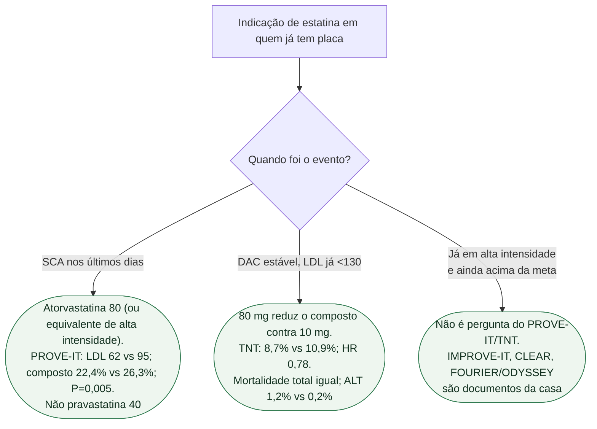

# Fluxograma: intensidade de estatina — SCA versus DAC estável

## Mensagem prática

**SCA: ir fundo cedo. Estável: 80 vs 10 reduz evento, não mortalidade total.** A meta numérica mudou; a mensagem de intensidade não.
