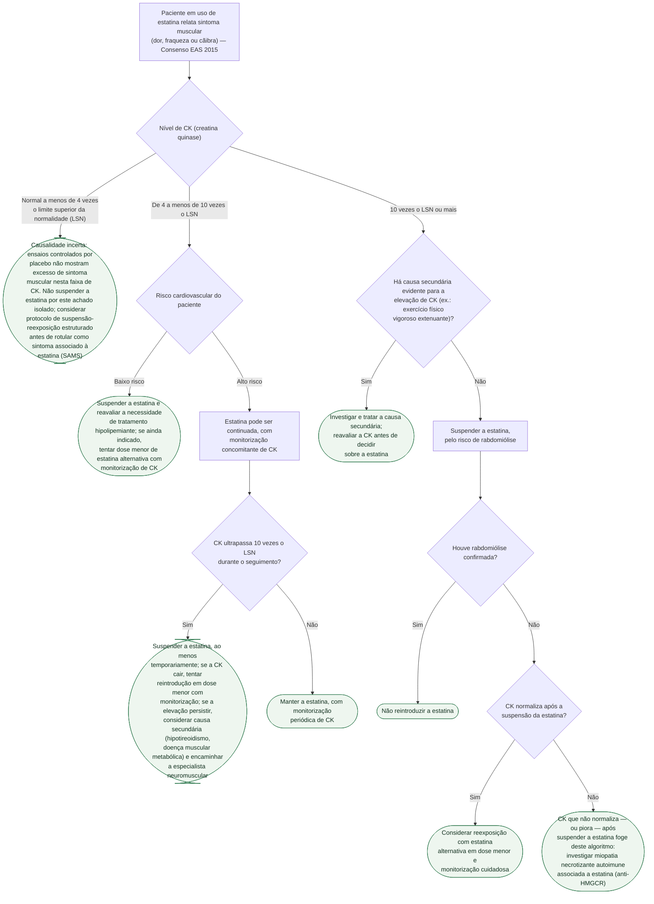

# Fluxograma: Intolerância a Estatina — Definição por CK e Protocolo de Reexposição (EAS 2015)

"Intolerância a estatina" costuma ser declarada depois de uma única queixa muscular, sem CK medida nem reexposição documentada. O Consenso da European Atherosclerosis Society (2015) propõe um critério operacional que separa o que precisa de investigação de CK e troca de esquema do que precisa de suspensão imediata — e reserva o rótulo de "intolerante à classe" para depois de um protocolo estruturado de suspensão e reexposição, geralmente com ao menos três estatinas diferentes.

## Árvore de decisão

## O que a árvore não mostra

**O protocolo de reexposição não é uma tentativa única.** O consenso recomenda, em geral, testar **ao menos três estatinas diferentes** (dose, fármaco ou esquema intermitente) antes de declarar o paciente intolerante à classe — só depois dessa sequência esgotada é que se parte para terapia hipolipemiante não estatínica.

**A reexposição cega valida o próprio protocolo**: no ensaio StatinWISE, 200 pacientes que já atribuíam sintoma muscular à estatina foram reexpostos de forma cega a estatina e placebo, alternando em blocos de 2 meses — sem diferença no escore de sintoma muscular entre os braços, e taxa de suspensão quase idêntica (9% vs. 7%). Isso não invalida a queixa do paciente; mostra por que a reexposição estruturada, e não a atribuição de memória, é o que separa causalidade real de coincidência temporal.

**Quando a intolerância é confirmada, a meta de LDL não é abandonada** — combina-se a dose máxima tolerada de estatina (que pode ser baixa ou intermitente) com terapia não estatínica (ezetimiba, ácido bempedoico, inibidor de PCSK9, conforme o cenário).

**A definição de "intolerante a estatina" usada em ensaios como o CLEAR Outcomes é mais ampla e menos rigorosa** que este protocolo — baseia-se em incapacidade ou recusa declarada pelo paciente, sem exigir a sequência estruturada de reexposição do consenso EAS. Vale ter essa diferença em mente ao extrapolar o resultado de um ensaio para um paciente individual.
